# Database Relationship Overview

This document is the **domain ERD source of truth** for FunnyX PostgreSQL entities.

Aligned with [readme.md](../readme.md):

- Corporate onboarding, games, Game Partner Game Coin, market submit → pending client-balance lock → admin approve → transfer to pool
- **C6 / C9 Corp fees:** Year-1 **80,000** / renewal **10,000** / new pair **10,000** (Admin fiat or USDT). Partner money movement = first/renew fee; Admin may disable APIs + notice deadline
- Market pool lock: required amount on client **Game Partner Game Coin** balance (not the 80K fee)
- First market paired with Platform Token
- E-shop **C2+C4:** platform fixed `PLT_*` **and** Corp products → Admin system base fiat (**HKD**/**USD**) list price → partner **fiat** pay → webhook credit/fulfill → `shop_topup` / `corp_shop_purchase`
- **C5:** Company Coin / Game Coin `asset_kind` may be `token`, `crypto_token`, or `stablecoin`; platform does not block (e.g. USDT as a valid company or game coin)
- **C7 Marketplace place deal:** verified (bought Platform Token) + playing ≥1 listed game + partner Transfer API open for asset
- Company Basic Token: Corp submit → Admin approve → buyable; on buy charge **0.1%** Company Basic Token fee (user gets 99.9%)

Status: **ERD + [`../database/`](../database/) aligned** (first draft, **12** schemas / **44** tables). Seeds, migrations, and runtime services still open. Prefer [§2 module diagrams](#2-module-split-er-diagrams) for attributes; §1 is overview edges only (key fields in boxes; full columns in `database/fx_*/01_tables.sql`).

## 1. Core Database Relationship Diagram

Overview edges only (real FKs). Polymorphic / aggregate associations are listed in [§5](#5-relationship-notes) and are **not** drawn here.
```mermaid
erDiagram
    CORPORATE_USER ||--o{ CORP_API_KEY : has
    CORPORATE_USER ||--o{ PARTNER_ENDPOINT : registers
    CORPORATE_USER ||--o{ GAME : owns
    CORPORATE_USER ||--o{ MARKET_PAIR : submits
    CORPORATE_USER ||--o{ PLATFORM_FEE : pays
    CORPORATE_USER ||--o{ CORP_PARTNER_NOTICE : receives
    CORPORATE_USER ||--o{ COMPANY_BASIC_TOKEN : submits
    CORPORATE_USER ||--o{ CORP_SHOP_PRODUCT : sells
    CORPORATE_USER ||--o{ DEPOSIT_WITHDRAWAL_TXN : partners
    CORPORATE_USER ||--o{ COIN_FEE_LEDGER : fee_source
    CORPORATE_USER ||--o{ MARKETPLACE_DEAL : parent_corp
    CORPORATE_USER ||--o{ GAME_COIN_SUPPLY_REQUEST : requests_supply
    CORPORATE_USER ||--o{ CORP_PAYMENT_RECORD : records_payments

    GAME ||--o{ GAME_ACCOUNT : has
    GAME ||--o{ GAME_BALANCE : creates
    GAME ||--o{ MARKET_PAIR : supports
    GAME ||--o{ MARKET_BALANCE_LOCK : reserves
    GAME ||--o{ COMPANY_BASIC_TOKEN : defines
    GAME ||--o{ MARKETPLACE_DEAL : lists_in
    GAME ||--o{ GAME_COIN_SUPPLY_REQUEST : supply_for

    END_USER ||--o{ USER_SESSION : opens
    END_USER ||--o{ OAUTH_IDENTITY : links
    OAUTH_IDENTITY ||--o{ USER_SESSION : authenticates
    END_USER ||--o{ GAME_ACCOUNT : binds
    END_USER ||--o{ SHOP_ORDER : buys_shop
    END_USER ||--o{ CORP_TOKEN_ORDER : buys_cbt
    END_USER ||--o{ MARKETPLACE_DEAL : posts
    END_USER ||--o{ MARKETPLACE_DEAL_REQUEST : requests
    END_USER ||--o{ DEPOSIT_WITHDRAWAL_TXN : initiates
    END_USER ||--o{ NOTIFICATION : receives
    END_USER ||--o{ OUTBOUND_NOTICE : queues
    END_USER ||--o{ CORP_PAYMENT_RECORD : appears_in

    GAME_ACCOUNT ||--o{ USER_WALLET : maps_to
    GAME_ACCOUNT ||--o{ DEPOSIT_WITHDRAWAL_TXN : belongs_to
    GAME_ACCOUNT ||--o{ SHOP_ORDER : purchases_shop
    GAME_ACCOUNT ||--o{ CORP_TOKEN_ORDER : purchases_cbt
    GAME_ACCOUNT ||--o{ MARKETPLACE_DEAL : posts_as
    GAME_ACCOUNT ||--o{ MARKETPLACE_DEAL_REQUEST : requests_as
    GAME_ACCOUNT ||--o{ ORDER : places
    GAME_ACCOUNT ||--o{ CORP_PAYMENT_RECORD : billed_as

    GAME_COIN ||--o{ GAME_BALANCE : supports
    GAME_COIN ||--o{ USER_WALLET : held_in
    GAME_COIN ||--o{ MARKET_PAIR : base_or_quote
    GAME_COIN ||--o{ MARKET_BALANCE_LOCK : locked_as
    GAME_COIN ||--o{ POOL_WALLET : stores
    GAME_COIN ||--o{ SHOP_PACKAGE : priced_as
    GAME_COIN ||--o{ CORP_SHOP_PRODUCT : priced_or_credited
    GAME_COIN ||--o{ SHOP_ORDER : credits
    GAME_COIN ||--o{ COMPANY_BASIC_TOKEN : represents
    GAME_COIN ||--o{ CORP_TOKEN_ORDER : buy_asset
    GAME_COIN ||--o{ COIN_FEE_LEDGER : fee_asset
    GAME_COIN ||--o{ MARKETPLACE_DEAL : offer_or_want
    GAME_COIN ||--o{ GAME_COIN_SUPPLY_REQUEST : increase_of
    GAME_COIN ||--o{ CORP_PAYMENT_RECORD : denominated_in

    PLATFORM_FEE ||--o| MARKET_PAIR : gates
    PLATFORM_FEE ||--o{ GAME_COIN_SUPPLY_REQUEST : fees
    MARKET_PAIR ||--o{ MARKET_BALANCE_LOCK : pending_locks
    MARKET_PAIR ||--o| MARKET_POOL : funds_after_approve
    MARKET_PAIR ||--o{ POOL_TRANSFER_EVENT : audits
    MARKET_PAIR ||--o{ MARKET_STATUS_LOG : tracks
    MARKET_PAIR ||--o{ ORDER : trades_in
    MARKET_PAIR ||--o{ TRADE : filled_as
    MARKET_PAIR ||--o{ MARKET_OHLCV : candles
    MARKET_PAIR }o--|| CORE_ENGINE : served_by

    MARKET_POOL ||--o{ POOL_WALLET : contains
    MARKET_POOL ||--o{ POOL_TRANSFER_EVENT : receives

    MARKET_BALANCE_LOCK ||--o{ POOL_TRANSFER_EVENT : released_by

    CORE_ENGINE ||--o{ ORDER : matches
    CORE_ENGINE ||--o{ TRADE : executes
    ORDER ||--o{ TRADE : buyer_or_seller

    ADMIN_USER ||--o{ ADMIN_ACTION_LOG : performs
    ADMIN_USER ||--o{ MARKET_PAIR : approves
    ADMIN_USER ||--o{ GAME_COIN : configures
    ADMIN_USER ||--o{ SYSTEM_SETTING : configures
    ADMIN_USER ||--o{ SHOP_PACKAGE : manages
    ADMIN_USER ||--o{ COMPANY_BASIC_TOKEN : approves_token
    ADMIN_USER ||--o{ GAME_COIN_SUPPLY_REQUEST : reviews_supply

    PARTNER_ENDPOINT ||--o{ SHOP_ORDER : collects_token_pay
    PARTNER_ENDPOINT ||--o{ CORP_TOKEN_ORDER : collects_cbt_token_pay
    PARTNER_ENDPOINT ||--o{ DEPOSIT_WITHDRAWAL_TXN : routes
    PARTNER_ENDPOINT ||--o{ MARKETPLACE_DEAL : transfer_for
    PARTNER_ENDPOINT ||--o{ MARKETPLACE_TRANSFER_EVENT : called_as

    SHOP_PACKAGE ||--o{ SHOP_ORDER : sold_as_platform
    CORP_SHOP_PRODUCT ||--o{ SHOP_ORDER : sold_as_corp
    SHOP_ORDER ||--o{ SHOP_PAYMENT_EVENT : audited_by
    SHOP_ORDER ||--o{ DEPOSIT_WITHDRAWAL_TXN : settles_as
    DEPOSIT_WITHDRAWAL_TXN ||--o{ DEPOSIT_WITHDRAWAL_STATUS_LOG : status_history

    COMPANY_BASIC_TOKEN ||--o{ CORP_TOKEN_ORDER : sold_as
    COMPANY_BASIC_TOKEN ||--o{ COIN_FEE_LEDGER : fees
    CORP_TOKEN_ORDER ||--o{ CORP_TOKEN_PAYMENT_EVENT : audited_by
    CORP_TOKEN_ORDER ||--o{ COIN_FEE_LEDGER : generates

    MARKETPLACE_DEAL ||--o{ MARKETPLACE_DEAL_REQUEST : receives
    MARKETPLACE_DEAL ||--o| MARKETPLACE_DEAL_REQUEST : matched_to
    MARKETPLACE_DEAL ||--o{ MARKETPLACE_TRANSFER_EVENT : settles_via
    MARKETPLACE_DEAL_REQUEST ||--o{ MARKETPLACE_TRANSFER_EVENT : fulfill_for

    OUTBOUND_NOTICE ||--o| NOTIFICATION : delivered_as

    CORPORATE_USER {
        bigint id
        varchar company_name
        varchar master_code
        varchar master_id
        varchar status
        boolean api_enabled
        bigint license_deadline_at
        bigint created_at
        bigint updated_at
    }

    CORP_PARTNER_NOTICE {
        bigint id
        bigint corporate_user_id
        varchar notice_type
        varchar title
        text body
        bigint deadline_at
        bigint related_platform_fee_id
        bigint created_by_admin_id
        bigint created_at
    }

    CORP_API_KEY {
        bigint id
        bigint corporate_user_id
        varchar api_key
        varchar secret_hash
        varchar status
        bigint created_at
    }

    PARTNER_ENDPOINT {
        bigint id
        bigint corporate_user_id
        varchar type
        varchar endpoint
        varchar auth_type
        varchar status
        bigint created_at
    }

    END_USER {
        bigint id
        varchar username
        varchar email
        varchar password_hash
        varchar status
        bigint created_at
    }

    OAUTH_IDENTITY {
        bigint id
        bigint end_user_id
        varchar provider
        varchar partner_id
        varchar partner_user_id
        bigint game_id
        varchar game_account_id
        varchar status
        bigint created_at
    }

    USER_SESSION {
        bigint id
        bigint end_user_id
        bigint oauth_identity_id
        varchar token
        varchar refresh_token
        varchar grant_type
        varchar partner_id
        varchar partner_user_id
        bigint expires_at
        bigint created_at
    }

    GAME {
        bigint id
        bigint corporate_user_id
        varchar game_name
        varchar game_code
        varchar partner_code
        varchar partner_game_id
        varchar status
        bigint created_at
    }

    GAME_ACCOUNT {
        bigint id
        bigint game_id
        bigint end_user_id
        varchar game_account_id
        varchar partner_user_id
        varchar bind_source
        varchar status
        bigint created_at
    }

    GAME_COIN {
        bigint id
        varchar code
        varchar name
        varchar type
        varchar asset_kind
        boolean is_platform_token
        varchar status
    }

    GAME_BALANCE {
        bigint id
        bigint game_id
        bigint game_coin_id
        decimal total_supply
        decimal available_balance
        decimal locked_balance
        bigint updated_at
    }

    USER_WALLET {
        bigint id
        bigint game_account_id
        bigint game_coin_id
        decimal available
        decimal locked
        bigint updated_at
    }

    PLATFORM_FEE {
        bigint id
        bigint corporate_user_id
        varchar fee_type
        decimal amount
        varchar pay_currency
        int license_year
        bigint related_market_pair_id
        boolean claim_next_year_license
        bigint claimed_against_fee_id
        varchar status
        bigint paid_at
    }

    GAME_COIN_SUPPLY_REQUEST {
        bigint id
        bigint corporate_user_id
        bigint game_id
        bigint game_coin_id
        decimal requested_amount
        decimal current_total_supply
        bigint platform_fee_id
        varchar status
        bigint approved_by_admin_id
        bigint approved_at
        bigint created_at
    }

    CORP_PAYMENT_RECORD {
        bigint id
        bigint corporate_user_id
        bigint end_user_id
        bigint game_account_id
        varchar item_code
        varchar package_code
        decimal amount
        bigint game_coin_id
        varchar status
        varchar partner_order_no
        bigint paid_at
        varchar source
        bigint created_at
    }

    MARKET_PAIR {
        bigint id
        bigint corporate_user_id
        bigint game_id
        bigint base_game_coin_id
        bigint quote_game_coin_id
        varchar market_name
        varchar funding_source
        bigint platform_fee_id
        bigint engine_id
        varchar status
        bigint approved_by_admin_id
        bigint created_at
    }

    MARKET_BALANCE_LOCK {
        bigint id
        bigint market_pair_id
        bigint game_id
        bigint game_coin_id
        decimal locked_amount
        varchar status
        bigint created_at
    }

    MARKET_POOL {
        bigint id
        bigint market_pair_id
        decimal pool_depth
        decimal initial_price
        decimal base_amount
        decimal quote_amount
        varchar status
        bigint created_at
    }

    POOL_WALLET {
        bigint id
        bigint market_pool_id
        bigint game_coin_id
        decimal balance
        varchar wallet_type
        varchar status
    }

    POOL_TRANSFER_EVENT {
        bigint id
        bigint market_pair_id
        bigint market_pool_id
        bigint market_balance_lock_id
        varchar event_type
        decimal amount
        bigint created_at
    }

    MARKET_STATUS_LOG {
        bigint id
        bigint market_pair_id
        varchar old_status
        varchar new_status
        bigint updated_by_admin_id
        bigint updated_at
    }

    CORE_ENGINE {
        bigint id
        varchar name
        varchar host
        varchar status
    }

    ORDER {
        bigint id
        bigint game_account_id
        bigint market_pair_id
        smallint order_type
        varchar side
        decimal price
        decimal qty
        smallint status
        bigint created_at
    }

    TRADE {
        bigint id
        bigint market_pair_id
        bigint buyer_order_id
        bigint seller_order_id
        decimal executed_price
        decimal executed_qty
        bigint executed_at
    }

    MARKET_OHLCV {
        bigint id
        bigint market_pair_id
        varchar timeframe
        bigint open_time
        bigint close_time
        decimal open
        decimal high
        decimal low
        decimal close
        decimal volume
        decimal quote_volume
        int trade_count
        bigint created_at
        bigint updated_at
    }

    MARKETPLACE_DEAL {
        bigint id
        bigint poster_end_user_id
        bigint poster_game_account_id
        bigint game_id
        bigint corporate_user_id
        bigint partner_endpoint_id
        varchar offer_asset_type
        bigint offer_game_coin_id
        varchar offer_item_ref_id
        decimal offer_amount
        varchar want_asset_type
        bigint want_game_coin_id
        decimal want_amount
        varchar status
        bigint matched_request_id
        bigint cancelled_at
        bigint completed_at
        bigint created_at
    }

    MARKETPLACE_DEAL_REQUEST {
        bigint id
        bigint marketplace_deal_id
        bigint requester_end_user_id
        bigint requester_game_account_id
        varchar status
        bigint created_at
    }

    MARKETPLACE_TRANSFER_EVENT {
        bigint id
        bigint marketplace_deal_id
        bigint marketplace_deal_request_id
        bigint partner_endpoint_id
        varchar request_id
        bigint from_game_account_id
        bigint to_game_account_id
        varchar asset_type
        bigint game_coin_id
        varchar item_ref_id
        decimal amount
        varchar status
        json payload
        bigint created_at
    }

    SYSTEM_SETTING {
        bigint id
        varchar setting_key
        varchar setting_value
        bigint updated_by_admin_id
        bigint updated_at
    }

    SHOP_PACKAGE {
        bigint id
        varchar code
        varchar name
        bigint game_coin_id
        decimal coin_amount
        decimal fiat_price
        varchar seller_type
        varchar status
        bigint created_by_admin_id
        bigint created_at
    }

    CORP_SHOP_PRODUCT {
        bigint id
        bigint corporate_user_id
        bigint game_id
        varchar code
        varchar name
        varchar product_type
        bigint credit_game_coin_id
        decimal credit_amount
        varchar item_code
        decimal fiat_price
        varchar seller_type
        varchar status
        bigint created_at
    }

    SHOP_ORDER {
        bigint id
        bigint game_account_id
        bigint end_user_id
        varchar seller_type
        bigint package_id
        bigint corp_product_id
        bigint corporate_user_id
        bigint partner_endpoint_id
        varchar partner_order_no
        varchar fiat_currency
        decimal fiat_price
        decimal credit_amount
        bigint game_coin_id
        varchar item_code
        varchar status
        bigint expires_at
        bigint paid_at
        bigint created_at
    }

    SHOP_PAYMENT_EVENT {
        bigint id
        bigint shop_order_id
        varchar event_id
        varchar event_type
        varchar partner_order_no
        varchar status
        json payload
        bigint received_at
    }

    COMPANY_BASIC_TOKEN {
        bigint id
        bigint corporate_user_id
        bigint game_id
        bigint game_coin_id
        varchar token_code
        varchar token_name
        varchar status
        boolean buyable
        decimal buy_fee_rate
        bigint approved_by_admin_id
        bigint approved_at
        bigint created_at
    }

    CORP_TOKEN_ORDER {
        bigint id
        bigint company_basic_token_id
        bigint end_user_id
        bigint game_account_id
        bigint partner_endpoint_id
        varchar partner_order_no
        decimal pay_amount
        bigint pay_game_coin_id
        decimal coin_amount
        decimal fee_coin_amount
        decimal credited_coin_amount
        bigint game_coin_id
        varchar status
        bigint expires_at
        bigint paid_at
        bigint created_at
    }

    CORP_TOKEN_PAYMENT_EVENT {
        bigint id
        bigint corp_token_order_id
        varchar event_id
        varchar event_type
        varchar partner_order_no
        varchar status
        json payload
        bigint received_at
    }

    COIN_FEE_LEDGER {
        bigint id
        bigint corporate_user_id
        bigint company_basic_token_id
        bigint corp_token_order_id
        bigint game_coin_id
        decimal fee_rate
        decimal gross_coin_amount
        decimal fee_coin_amount
        decimal net_coin_amount
        bigint created_at
    }

    DEPOSIT_WITHDRAWAL_TXN {
        bigint id
        bigint end_user_id
        bigint game_account_id
        bigint corporate_user_id
        bigint partner_endpoint_id
        bigint shop_order_id
        varchar transaction_type
        decimal amount
        bigint game_coin_id
        varchar status
        bigint created_at
    }

    DEPOSIT_WITHDRAWAL_STATUS_LOG {
        bigint id
        bigint deposit_withdrawal_txn_id
        varchar old_status
        varchar new_status
        varchar event_type
        text note
        json payload
        bigint created_at
    }

    ADMIN_USER {
        bigint id
        varchar username
        varchar role
        varchar status
    }

    ADMIN_ACTION_LOG {
        bigint id
        bigint admin_id
        varchar action
        json metadata
        bigint created_at
    }

    NOTIFICATION {
        bigint id
        bigint end_user_id
        varchar type
        json payload
        bigint read_at
        bigint created_at
    }

    OUTBOUND_NOTICE {
        bigint id
        bigint end_user_id
        varchar source_type
        bigint source_id
        varchar event_type
        varchar title
        text body
        json payload
        varchar delivery_status
        int retry_count
        bigint scheduled_at
        bigint sent_at
        bigint notification_id
        bigint created_at
    }

    WEBHOOK_EVENT {
        bigint id
        varchar source
        varchar event_type
        json payload
        bigint received_at
    }
```

## 2. Module-split ER diagrams

Diagrams below match the **12** PostgreSQL schemas in [`../database/`](../database/). Cross-schema neighbors appear as stubs (name only) so each module stays readable; full attributes live in the owning module.

| Schema | Section |
| --- | --- |
| `fx_corp` | [2.1 Corp](#21-corp-fx_corp) |
| `fx_game` | [2.2 Game](#22-game-fx_game) |
| `fx_user` | [2.3 User](#23-user-fx_user) |
| `fx_market` | [2.4 Market](#24-market-fx_market) |
| `fx_market_data` | [2.5 Market data](#25-market-data-fx_market_data) |
| `fx_marketplace` | [2.6 Marketplace](#26-marketplace-fx_marketplace) |
| `fx_config` | [2.7 Config](#27-config-fx_config) |
| `fx_shop` | [2.8 E-shop](#28-e-shop-fx_shop) |
| `fx_corp_token` | [2.9 Corp token](#29-corp-token-fx_corp_token) |
| `fx_money` | [2.10 Money](#210-money-fx_money) |
| `fx_admin` | [2.11 Admin](#211-admin-fx_admin) |
| `fx_events` | [2.12 Events](#212-events-fx_events) |

### 2.1 Corp (`fx_corp`)

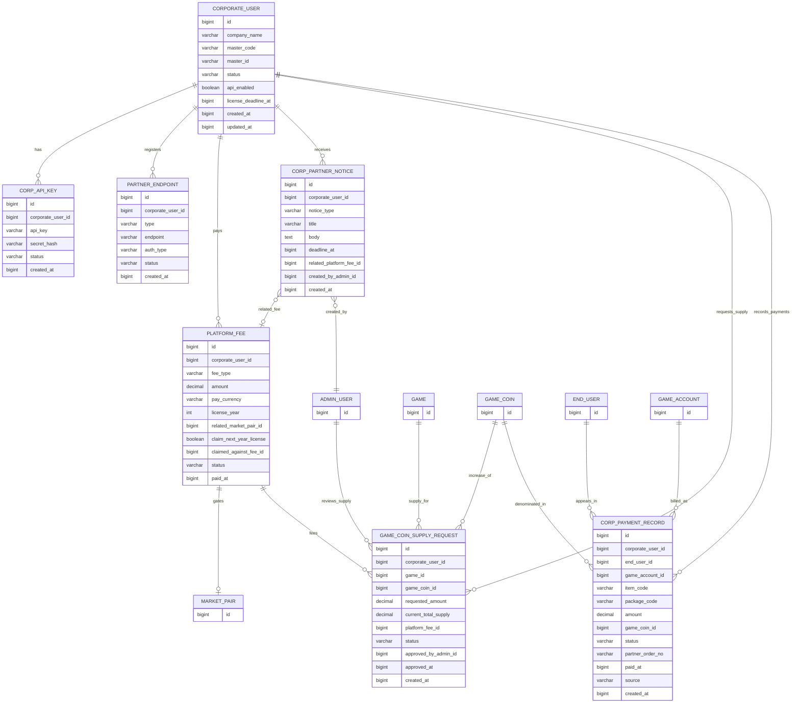

### 2.2 Game (`fx_game`)

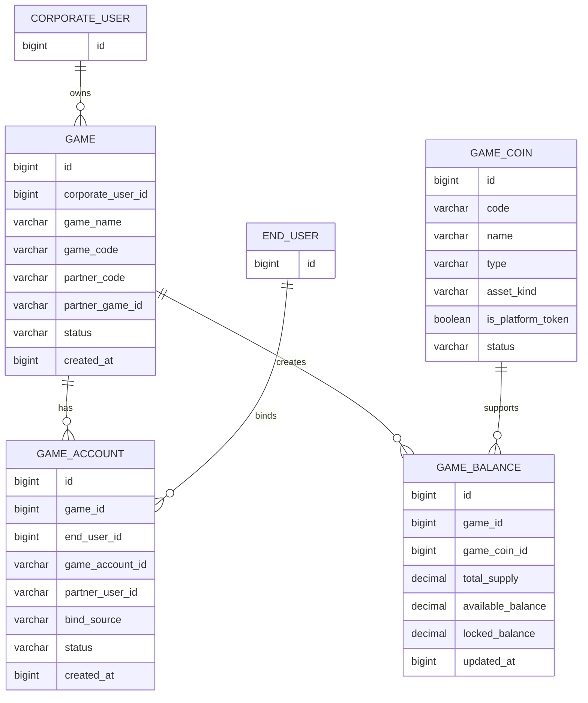

### 2.3 User (`fx_user`)

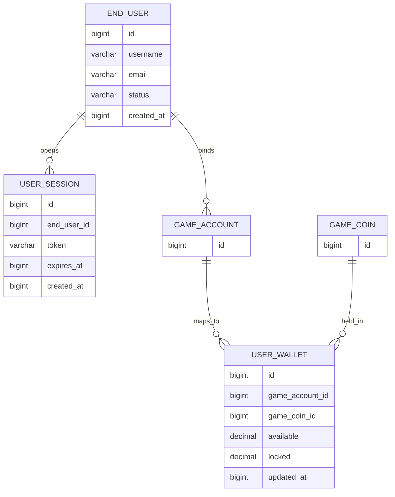

### 2.4 Market (`fx_market`)

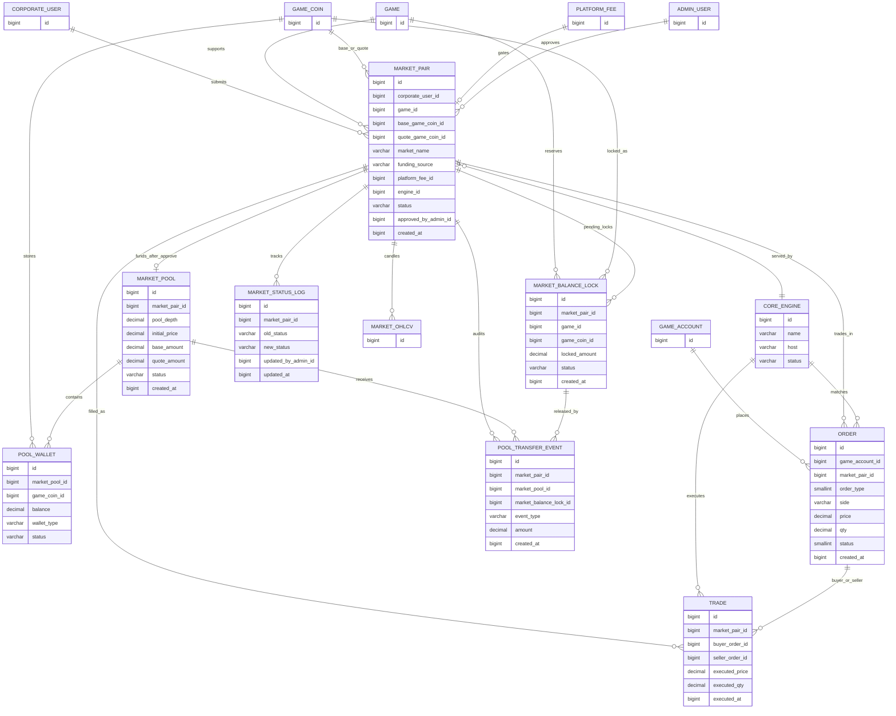

### 2.5 Market data (`fx_market_data`)

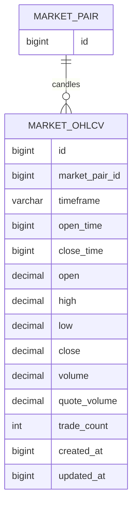

### 2.6 Marketplace (`fx_marketplace`)

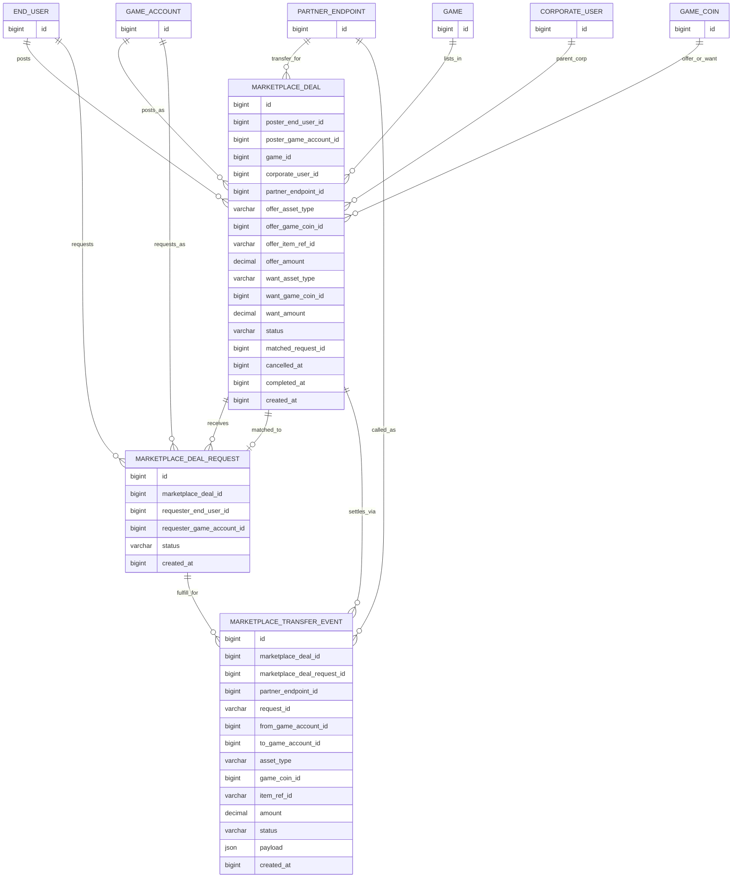

### 2.7 Config (`fx_config`)

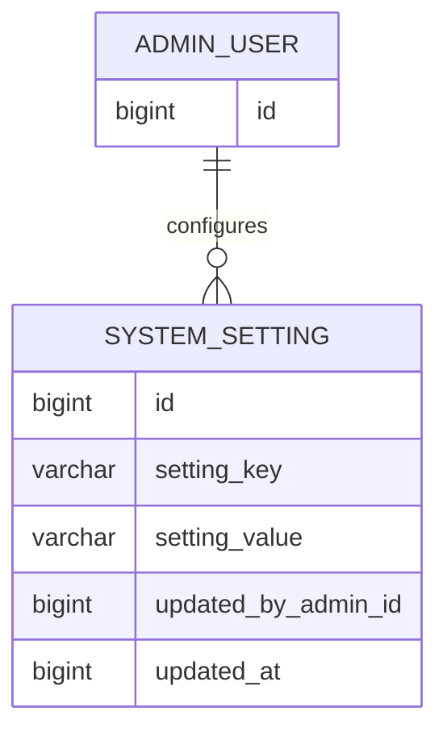

### 2.8 E-shop (`fx_shop`)

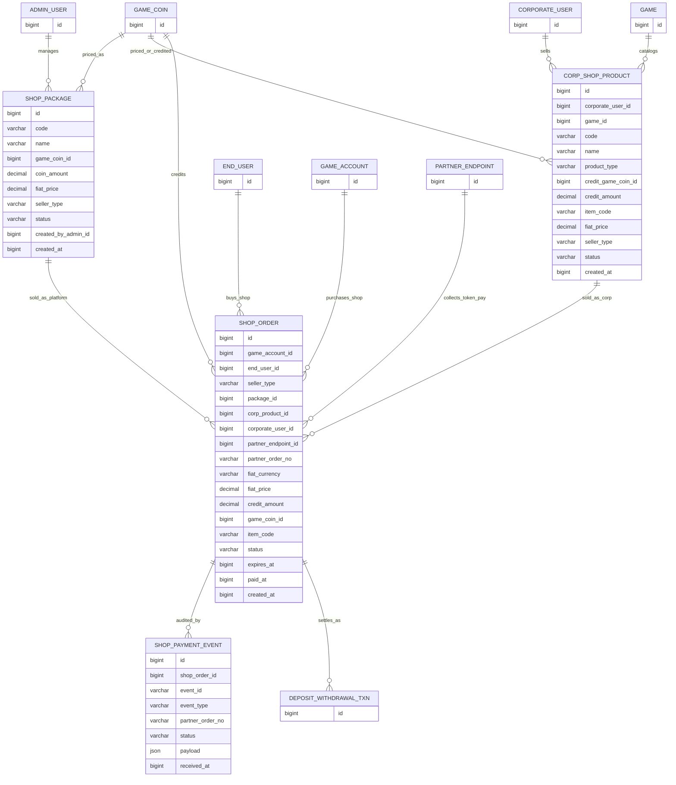

### 2.9 Corp token (`fx_corp_token`)

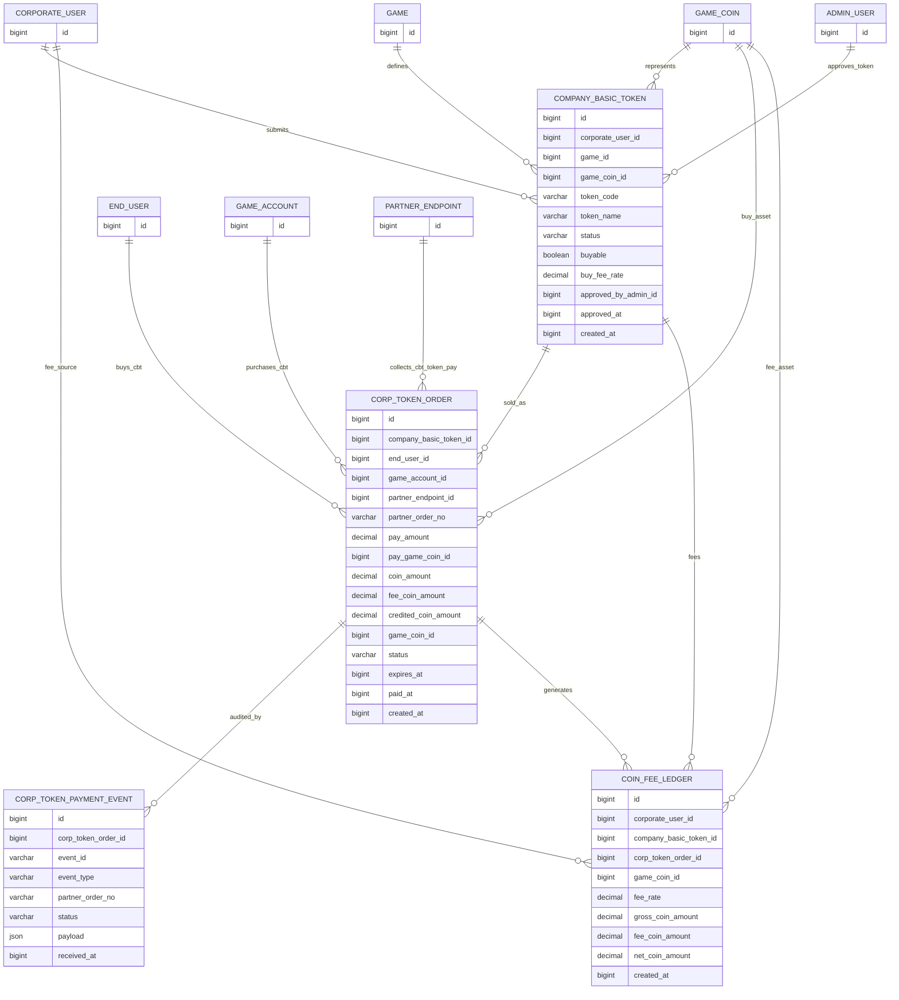

### 2.10 Money (`fx_money`)

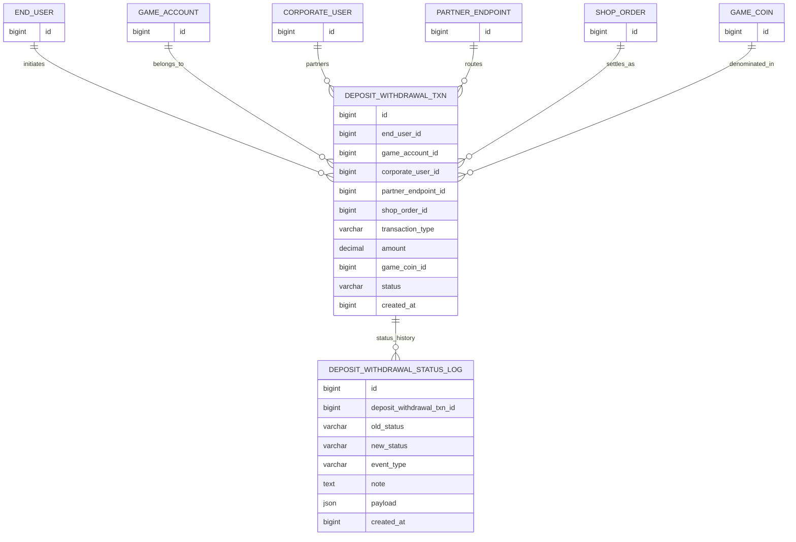

### 2.11 Admin (`fx_admin`)

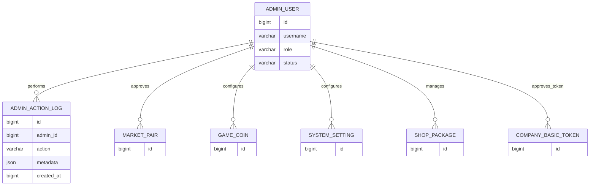

### 2.12 Events (`fx_events`)

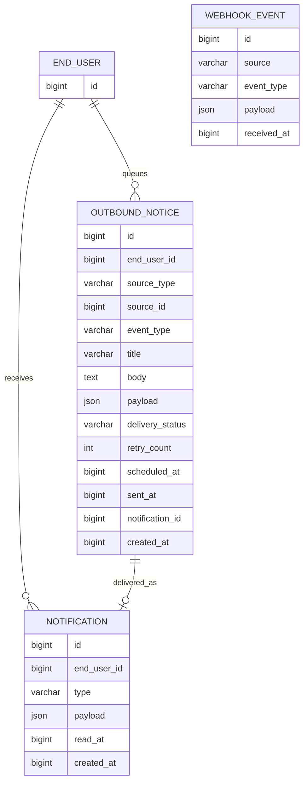

## 3. Table inventory (required domain set)

| Group | Table | Purpose |
| --- | --- | --- |
| Corp | `CORPORATE_USER` | Game company / partner identity (`master_code`, `master_id`) |
| Corp | `CORP_API_KEY` | API key + hashed secret for Corp APIs |
| Corp | `PARTNER_ENDPOINT` | One row per endpoint `type` (`oauth_authorize` / `oauth_token` / `oauth_userinfo` / `deposit` / `withdrawal` / `transfer` / `payment` / `callback`); URL in `endpoint` |
| Corp | `PLATFORM_FEE` | C6: `year1_package` 80K / `license_renewal` 10K / `new_pair` 10K / `supply_increase`; `pay_currency` HKD\|USD\|USDT |
| Corp | `CORP_PARTNER_NOTICE` | C9: contract fee deadline / API-disable notices to partner |
| Corp | `GAME_COIN_SUPPLY_REQUEST` | Corp request to raise Game Partner Game Coin supply; Admin approve → bump `GAME_BALANCE.total_supply`; optional `platform_fee_id` |
| Corp | `CORP_PAYMENT_RECORD` | End-user payment accounting via Corp notify/history APIs (`source` live\|test); **not** e-shop wallet credit |
| Game | `GAME` | Onboarded game under a corporate user |
| Game | `GAME_ACCOUNT` | Game Account ID mapping to end user |
| Game | `GAME_COIN` | Asset definitions; `is_platform_token` marks Platform Token; `asset_kind` = `token` / `crypto_token` / `stablecoin` (Corp may choose; platform does not block) |
| Game | `GAME_BALANCE` | Game supply + available/locked company balances |
| User | `END_USER` | Client Web end user |
| User | `USER_SESSION` | Session token cache source-of-truth companion |
| User | `USER_WALLET` | End-user available/locked balances per game asset and game coin |
| Market | `MARKET_PAIR` | Submitted pair; statuses include `submitted`, `pending_locked`, `approved`, `active` |
| Market | `MARKET_BALANCE_LOCK` | Pending lock of required amount on client/game balance |
| Market | `MARKET_POOL` | Pool after admin approval + transfer |
| Market | `POOL_WALLET` | Per-coin balances inside the market pool |
| Market | `POOL_TRANSFER_EVENT` | Audit: lock / unlock / transfer_to_pool |
| Market | `MARKET_STATUS_LOG` | Pair status history |
| Market | `CORE_ENGINE` | Matching engine instance |
| Market | `ORDER` | Exchange orders (not e-shop) |
| Market | `TRADE` | Exchange trades |
| Market data | `MARKET_OHLCV` | Candle bars: open/high/low/close + volume per `timeframe` (`15m`\|`1h` first draft); unique on (`market_pair_id`, `timeframe`, `open_time`) |
| Marketplace | `MARKETPLACE_DEAL` | C7 listing: offer game_coin/company_coin/game_item; want platform_token or parent company_coin; game_item uses opaque `offer_item_ref_id` from partner Item List API |
| Marketplace | `MARKETPLACE_DEAL_REQUEST` | Buyer request against an open deal (unique per deal + requester) |
| Marketplace | `MARKETPLACE_TRANSFER_EVENT` | Partner Transfer audit on settle (`request_id` idempotent; `item_ref_id` for game_item) |
| Config | `SYSTEM_SETTING` | `base_fiat_currency` = `HKD`\|`USD` for e-shop (C4) and Corp fee fiat (C6) |
| E-shop | `SHOP_PACKAGE` | Platform fixed `PLT_*` (credit + `fiat_price`) |
| E-shop | `CORP_SHOP_PRODUCT` | Corp products with `fiat_price` in system base currency |
| E-shop | `SHOP_ORDER` | Shop intents with fiat snapshot (`seller_type` platform\|corp) |
| E-shop | `SHOP_PAYMENT_EVENT` | Idempotent shop webhook payment audit |
| Corp token | `COMPANY_BASIC_TOKEN` | Corp-submitted token; buyable only after Admin approve |
| Corp token | `CORP_TOKEN_ORDER` | End-user buy order for Company Basic Token |
| Corp token | `CORP_TOKEN_PAYMENT_EVENT` | Idempotent corp-token payment webhook audit |
| Corp token | `COIN_FEE_LEDGER` | 0.1% Company Basic Token buy fee records |
| Money | `DEPOSIT_WITHDRAWAL_TXN` | deposit / withdrawal / `shop_topup` / `corp_shop_purchase` |
| Money | `DEPOSIT_WITHDRAWAL_STATUS_LOG` | Status-change audit for deposit/withdrawal (created / pending_payment / completed / cancelled / rejected / failed) |
| Admin | `ADMIN_USER` | Admin RBAC users |
| Admin | `ADMIN_ACTION_LOG` | Admin audit trail |
| Events | `OUTBOUND_NOTICE` | Message Center outbox (`delivery_status=pending`) for marketplace / order / trade / shop_order / deposit-withdrawal / corp-token status events |
| Events | `NOTIFICATION` | User inbox after outbound notice is sent |
| Events | `WEBHOOK_EVENT` | Inbound webhook copies / ops log |

## 4. Market money flow (A1)

1. **Client Submitted** — insert `MARKET_PAIR` (+ C6 `PLATFORM_FEE` year1/pair paid or claimable).
2. **Under Pending** — insert `MARKET_BALANCE_LOCK`; increase `GAME_BALANCE.locked_balance` (or equivalent); status `pending_locked`.
3. **Wait Admin User Review** — admin reads pair, fee, funding source, lock.
4. **Confirm approval** — admin sets approved; on reject → unlock (`MARKET_BALANCE_LOCK.status = unlocked`).
5. **Transfer Client Balance to Pool** — create/update `MARKET_POOL` + `POOL_WALLET`; `POOL_TRANSFER_EVENT.event_type = transfer_to_pool`; lock → `transferred`.

## 5. Relationship notes

- Corporate User owns games, partner endpoints, C6 fees (Admin fiat or USDT), and market submissions.
- Pending market liquidity is **client-balance locked**, not pool-held, until admin approval.
- First market for a game must use Platform Token as base or quote (`GAME_COIN.is_platform_token = true`).
- `MARKET_PAIR` has two coin FKs: `base_game_coin_id` and `quote_game_coin_id`.
- Canonical fee link: `MARKET_PAIR.platform_fee_id` is primary; `PLATFORM_FEE.related_market_pair_id` is optional back-ref.
- E-shop / corp-token buy orders are not exchange `ORDER`s and never enter Core Engine matching.
- Paid **platform** e-shop settlement must create `DEPOSIT_WITHDRAWAL_TXN` with `transaction_type = shop_topup` and credit Platform Token `USER_WALLET`.
- Paid **Corp** e-shop settlement must credit coin package or fulfill item and record `corp_shop_purchase`.
- Idempotent shop settlement keys: `SHOP_PAYMENT_EVENT.event_id`, `SHOP_ORDER.partner_order_no`.
- Company Basic Token is buyable only when `status=approved` and `buyable=true`.
- On corp-token buy settle: `fee_coin_amount = coin_amount * 0.001`, `credited_coin_amount = coin_amount - fee_coin_amount`; write `COIN_FEE_LEDGER`.
- **Logical (no FK):** `OUTBOUND_NOTICE` uses polymorphic `(source_type, source_id)` for marketplace / order / trade / shop_order / deposit_withdrawal_txn / corp_token_order. Message Center drains `delivery_status=pending`; on send write `NOTIFICATION` and set `sent`.
- **Logical (no FK):** `MARKET_OHLCV` bars aggregate from `TRADE` prints or engine candle updates; Redis `market:{id}:ticker` is live only. Only `MARKET_PAIR → MARKET_OHLCV` is a real FK.
- Status history: first draft only `DEPOSIT_WITHDRAWAL_STATUS_LOG`; other domains use row `status` + `OUTBOUND_NOTICE`.
- Marketplace deals are **not** exchange `ORDER`/`TRADE`; settle via partner Transfer (`MARKETPLACE_TRANSFER_EVENT`).
- Marketplace **game_item**: partner **Item List / game-assets list API** (readme Required Partner API #5) returns opaque ids; store as `offer_item_ref_id` / transfer `item_ref_id` (`VARCHAR`). No platform item catalog or escrow table in first draft.
- Marketplace want side: `platform_token` or **parent** `company_coin` only (`want_game_coin` must match deal `corporate_user_id` / platform token — app check).
- Marketplace `partner_endpoint_id` must be `PARTNER_ENDPOINT.type = transfer` and enabled (app check).
- C7 place-deal eligibility (bought Platform Token + playing ≥1 listed game + Transfer open) is derived at API time, not a persisted table.
- `CORP_PARTNER_NOTICE` is corp/Admin channel — not drained via Message Center `OUTBOUND_NOTICE`.

## 6. Implementation notes

- Prefer this ERD over older `client_accounts`-only drafts.
- **Runnable DDL:** [`../database/`](../database/) — **12** schemas (`fx_*`), **43** tables, one folder per schema; apply via `database/run_all.sql`.
- Entity attribute boxes list key domain fields; full columns live in `database/fx_*/01_tables.sql` (corp supply/payments: `fx_corp/02_supply_and_payments.sql`).
- Corp payment records are partner accounting only; e-shop settlement stays on `SHOP_ORDER` + `DEPOSIT_WITHDRAWAL_TXN`.
- On approved `GAME_COIN_SUPPLY_REQUEST`, increase `GAME_BALANCE.total_supply` (and available as product rules define).
- Use BIGINT UTC timestamps; encrypt/hash secrets; index `corporate_user_id`, `game_id`, `game_account_id`, `market_pair_id`, `partner_order_no`, `status`, `created_at`, `delivery_status`.
- Redis/Mongo remain for cache and notice history; PostgreSQL `OUTBOUND_NOTICE` is the wait-to-send source of truth for Message Center.
