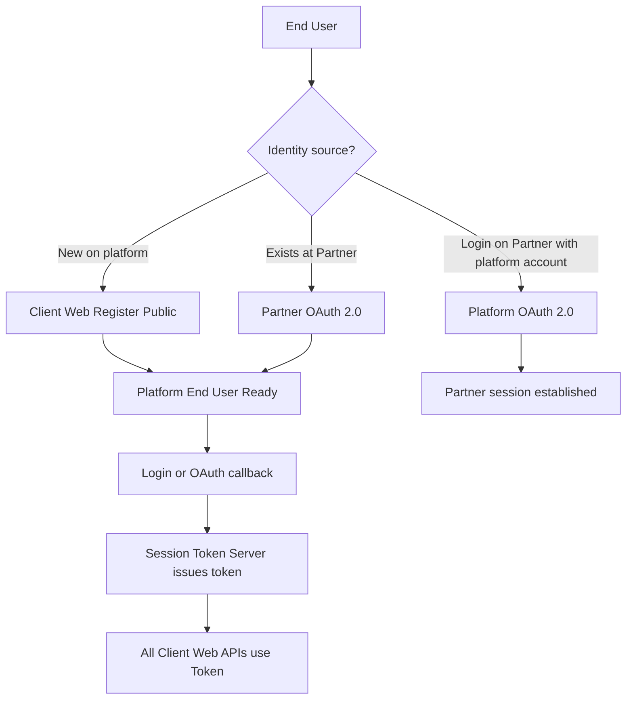

# Client Connectivity and Authentication Specification

This doc is a detail file for the master architecture in [project.md](project.md). See also the product summary in [readme.md](../readme.md) and the API index in [api-master.md](../api-master.md).

**Detail scope:** Client Web vs Company Partner credentials (C8), **OAuth 2.0** user verify (platform ↔ partner), Session Token Server binding, HTTP signatures — not partner fee/deposit contract tables (see [partner.md](partner.md)).

## 1. Overview (C8 + OAuth)

Master auth split: [project.md](project.md) §5.1. This file specifies **how** each caller authenticates and how **OAuth 2.0** fits in.

| Caller | Credential | Target |
| --- | --- | --- |
| **Client Web** (End User browser/app) | **Token from Session Token Server** (after login / OAuth) | Gateway → Client Center / services |
| **Company Partner** (Client backend) | **Master Account Code + Master ID + API Key + Secret** | Direct Client Center / corp APIs (via Gateway ingress) |

Master secrets never ship in Client Web. Client Web never uses MasterSigned.

**OAuth 2.0 (readme):** Partner OAuth verifies users on the platform; platform OAuth lets Partner-registered users (or platform-registered users) login across the boundary. Required Partner APIs: [partner.md](partner.md) §0.

## 2. Account identity sources

| Source | How |
| --- | --- |
| **A. Client Web register** | End user creates a platform account on Client Web (Public register → Client Center). |
| **B. Partner OAuth 2.0** | User already at Partner. Client Web runs Partner OAuth authorize → token → userinfo; platform links/creates end user. |
| **C. Platform OAuth 2.0 for Partner** | User registered on platform; Partner uses platform OAuth so that user can login on Partner. |

After A/B (and whenever Client Web needs a platform session), **Session Token Server** issues the Client Web session token.



## 3. OAuth 2.0 flows (detail)

### 3.1 Partner → Platform (user verify on platform)

1. Client Web redirects to Partner endpoint `type=oauth_authorize`.
2. User authenticates at Partner; Partner redirects with `code`.
3. Platform exchanges `code` at Partner `type=oauth_token`, then loads `type=oauth_userinfo`.
4. Client Center links or creates end user + game account binding.
5. Session Token Server returns platform session token to Client Web.

### 3.2 Platform → Partner (login on Partner)

1. Partner redirects to platform OAuth authorize (user already registered on platform, or registers on platform first).
2. User consents / logs in on platform (Public login or register).
3. Partner exchanges authorization code for tokens via platform OAuth token endpoint.
4. Partner establishes its own session; platform session for Client Web remains Token Server–based when user returns to Client Web.

OAuth client credentials for Partner backends use Corp Master registration (client_id / client_secret mapped to Master keys per implementation). End-user browser never holds Master Secret.

## 4. Client Web — Token Server required

**C3 / C8:**

| Auth | When |
| --- | --- |
| **Public** | Register, password login, and OAuth authorize/callback entry — used to **obtain** the Token Server token. |
| **Session (Token)** | **All other** Client Web API calls must include the Token Server token. |

1. End user completes password login or OAuth callback on Client Web.
2. Gateway → Session Token Server (Client Center validation as needed).
3. **Session Token Server returns a token** to Client Web.
4. Client Web attaches that token on **every** following API and socket call.

```text
Client Web  --Token (Session Token Server)-->  Gateway  -->  Client Center
```

## 5. Company Partner — Master credentials required

Direct calls from Company Partner into Client Center / platform corp surfaces require **all** of:

1. **Master Account Code**
2. **Master ID**
3. **API Key**
4. **Secret** (request signature)

```text
Company Partner  --Master Account Code + Master ID + API Key + Secret-->  Gateway  -->  Client Center
```

Used for: Corp User APIs, endpoint registration (including OAuth URLs), fees, markets, payments sync, Transfer, OAuth client admin, test probes.

## 6. HTTP signature notes (MasterSigned / Corp only)

For Company Partner → Client Center:

- Body + **Master ID** + **timestamp** (+ Master Account Code / API Key per contract)
- Canonical form: `"String_Of_Value"`
- **Secret** used to sign; never exposed to Client Web

For Client Web: Token Server token on the request only — no Master signature in the browser.

## 7. Socket communication

1. After login or OAuth, Session Token Server has issued a token.
2. Client Web connects to Gateway socket with that token.
3. Gateway validates token (Session Token Server / cache) and establishes the realtime session.

## 8. Security Requirements

- Master Account Code / Master ID / API Key / Secret: Company Partner backends only; never in Client Web bundles.
- Token Server tokens: short-lived, Redis-backed, revoke on logout; required on all Client Web APIs after login/OAuth.
- Partner **must** expose OAuth 2.0 and Transfer APIs; Item List for Marketplace game items; balance + deposit/withdraw only if partner does not use platform wallet APIs ([partner.md](partner.md) §0).
- Marketplace **place deal** additionally requires C7 gates (+ Item List for game_item). See [marketplace.md](marketplace.md).
