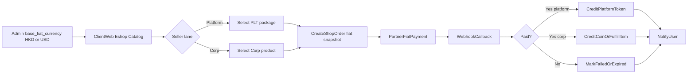

# E-shop Specification

This doc is a detail file for the product and architecture summary in [readme.md](../readme.md) and [project.md](project.md). The API index is in [api-master.md](../api-master.md).

**Detail scope:** Client Web e-shop catalog, fiat checkout (C2/C4), order lifecycle, partner payment/callback JSON, settlement rules, and service boundaries — not exchange matching or Marketplace Transfer.

[readme.md](../readme.md) may still describe token-only shop in places; **this file is authoritative for e-shop money** (fiat HKD/USD per Admin `base_fiat_currency`).

## 1. Scope (C2 + C4)

Master rule: [project.md](project.md) §4 step 7. Two seller lanes and fiat pricing:

The e-shop has **two seller lanes**:

| Lane | Seller | What is sold |
| --- | --- | --- |
| **A. Platform fixed items** | Platform | Fixed Platform Token packages (`PLT_*`) |
| **B. Corp e-shop products** | Corporate User | Corp-created products for sale (Game Coin packages, Company Coin packages, or game items) |

**C4 — Fiat for all listed e-shop items:**

- Every item in the e-shop catalog (platform fixed `PLT_*` **and** Corp-created products) is priced and paid in **fiat currency**.
- Allowed fiat codes: **HKD** or **USD**.
- Admin configures the **system base currency** (`HKD` or `USD`). All e-shop list prices and partner payments use that base currency.
- Buyer pays fiat via the partner payment endpoint; token/item **credit or fulfillment** runs only after a successful partner webhook callback.

E-shop purchases are not exchange orders. They do not enter the Core Engine matching path.

**Company Basic Token** (Corp submit → Admin approve → 0.1% fee) remains a **separate** buyable surface (`/v1/corp-tokens`), not the Corp e-shop product catalog. See §11. CBT buy remains token-settled unless product docs change it.

## 2. System base currency (Admin)

| Setting | Owner | Values | Effect |
| --- | --- | --- | --- |
| `base_fiat_currency` | Admin | `HKD` \| `USD` | Fiat for **all** e-shop listed item prices/pay **and** C6 Corp fee fiat denomination (Admin may switch, e.g. HKD instead of USD) |

Rules:

- Exactly one system base fiat currency is active at a time.
- Client Web catalog shows prices in the current base currency.
- New shop orders snapshot `fiat_currency` + `fiat_price` at create time (so a later Admin currency switch does not rewrite in-flight orders).
- Changing base currency is an Admin operation; existing `active` catalog rows keep numeric `fiat_price` but display/pay under the new code only after Admin reviews/updates prices as needed.

## 3. Actors

| Actor | Responsibility |
| --- | --- |
| Admin | Set system `base_fiat_currency` (HKD/USD); set/activate platform fixed package fiat prices; monitor orders; suspend Corp products |
| Corporate User | Create / update / activate Corp e-shop products with fiat prices in the system base currency |
| End User | Browse catalog, checkout, complete **fiat** payment via partner |
| Partner payment endpoint | Collect fiat payment and send payment callbacks |
| Webhook Server | Receive payment callbacks and forward settlement events |
| Client Center | Create shop orders; credit wallet or fulfill product after paid settlement |
| Message Center | Notify the user of payment and credit / fulfillment results |

## 4. Lane A — Platform Fixed Package Catalog (`PLT_*`)

These four packages are the only **platform** buyable items. Each credits a fixed Platform Token amount and has a **fiat list price** in the system base currency:

| Package code | Platform Token credited | Fiat price | Fiat currency |
| --- | ---: | ---: | --- |
| `PLT_1000` | 1,000 | Admin-configured | System `base_fiat_currency` (HKD or USD) |
| `PLT_1500` | 1,500 | Admin-configured | same |
| `PLT_3000` | 3,000 | Admin-configured | same |
| `PLT_10000` | 10,000 | Admin-configured | same |

Required fields per package row:

- `code` - one of the fixed codes above
- `name` - display name
- `game_coin_id` - Platform Token to credit
- `coin_amount` - Platform Token amount to credit
- `fiat_price` - list price in system base fiat
- `status` - `active`, `inactive`, or `archived`
- `seller_type` - always `platform`

Rules:

- Platform credit amounts are fixed; do not invent ad-hoc platform package credit amounts in Client Web.
- Admin may seed/activate/deactivate rows and set **`fiat_price`**; Admin must not invent new platform SKU credit amounts outside this set.
- Only `active` packages are visible in Client Web.
- Packages credit **Platform Token** after **fiat** payment settles.
- Archive or deactivate packages instead of deleting them when historical orders reference them.

## 5. Lane B — Corp E-shop Products

Corporate Users may create their own e-shop products for sale on Client Web. **All Corp list prices are fiat** in the system base currency (same HKD/USD as platform items).

### 5.1 Product types

| `product_type` | Meaning | On paid settlement |
| --- | --- | --- |
| `game_coin_package` | Credits buyer wallet with a Game Coin amount | Credit `credit_game_coin` / `credit_amount` |
| `company_coin_package` | Credits buyer wallet with Company Coin | Credit company coin amount |
| `game_item` | Delivers / records a game item grant | Fulfill `item_code` (partner/game notify as needed) |

### 5.2 Product fields

- `corporate_user_id` - owning Corp
- `game_id` - optional game scope
- `code` - unique per company
- `name` - display name
- `product_type` - see table above
- `credit_game_coin_id` / `credit_amount` - required for coin package types
- `item_code` - required for `game_item`
- `fiat_price` - list price in system base fiat (HKD or USD)
- `status` - `draft`, `active`, `inactive`, `archived`
- `seller_type` - always `corp`

Rules:

- Corp may create, update, activate, and deactivate their own products.
- Only `active` Corp products appear in Client Web.
- Admin may force `inactive` / suspend; Admin does not invent Corp SKUs.
- Fiat price currency is always the system `base_fiat_currency` — Corp does not pick a different fiat code per product.
- Distinct from Company Basic Token approval flow (§11).

## 6. Order Lifecycle

Shop order statuses (both lanes):

| Status | Meaning |
| --- | --- |
| `pending` | Order created; waiting for partner fiat payment result (payable for **24 hours** from create) |
| `paid` | Partner confirmed fiat payment; credit / fulfillment completed or in finalization |
| `failed` | Partner reported failure |
| `expired` | Payment window elapsed without success |
| `cancelled` | User or system cancelled before payment |

Flow:

1. User signs in on Client Web via password login or Partner/Platform **OAuth 2.0** (Session Token Server → session) and opens the e-shop.
2. User selects either a platform fixed `PLT_*` package **or** an active Corp product (prices shown in system base fiat).
3. Client Center creates a shop order in `pending` (`seller_type` = `platform` or `corp`), snapshots `fiat_currency` + `fiat_price`, and requests **fiat** payment from the partner endpoint.
4. Partner returns a payment reference (`partner_order_no`) and checkout payload.
5. User completes **fiat** payment with the partner.
6. Partner sends a webhook callback to the Webhook Server.
7. Platform records a payment event and settles the order idempotently.
8. On success:
   - **Platform package:** credit Platform Token to `USER_WALLET`; `shop_topup` txn.
   - **Corp product:** credit coin package or fulfill game item; record `corp_shop_purchase` txn.
9. Message Center notifies the user of the final status.



## 7. Partner Payment Contract (fiat)

### 7.1 Create payment request

```json
{
  "request_id": "req_shop_1001",
  "shop_order_id": 5001,
  "seller_type": "platform",
  "partner_id": "partner_2001",
  "user_id": "user_1001",
  "game_account_id": "player_9001",
  "package_code": "PLT_1000",
  "product_code": null,
  "credit_game_coin": "PLT",
  "credit_amount": 1000,
  "fiat_currency": "HKD",
  "fiat_price": 88.00,
  "callback_url": "https://platform.example.com/webhook/shop/payment",
  "return_url": "https://client.example.com/shop/orders/5001",
  "created_at": "2026-09-28T01:00:00Z"
}
```

`fiat_currency` must equal the system `base_fiat_currency` at order create. Corp product example: set `seller_type` to `corp`, `package_code` to null, `product_code` to the Corp product code, and credit fields from the product row; `fiat_price` from the product.

### 7.2 Create payment response

```json
{
  "partner_order_no": "PAY-7788",
  "checkout_url": "https://partner.example.com/pay/PAY-7788",
  "status": "pending",
  "expires_at": "2026-09-28T01:30:00Z"
}
```

### 7.3 Payment callback

```json
{
  "event_id": "pay_evt_8899",
  "partner_order_no": "PAY-7788",
  "shop_order_id": 5001,
  "seller_type": "platform",
  "status": "paid",
  "fiat_currency": "HKD",
  "fiat_paid": 88.00,
  "credit_game_coin": "PLT",
  "credit_amount": 1000,
  "paid_at": "2026-09-28T01:05:00Z",
  "signature": "***"
}
```

Callback `status` values expected by the platform: `paid`, `failed`, `cancelled`.

## 8. Settlement and Wallet Credit Rules

- Settlement is **idempotent** on `event_id` and `partner_order_no`.
- Duplicate paid callbacks must not credit or fulfill twice.
- Settle only when:
  1. the shop order is still `pending`,
  2. the callback signature/auth is valid,
  3. `fiat_currency` / `fiat_paid` match the order snapshot,
  4. for platform: `package_code` is one of `PLT_1000` / `PLT_1500` / `PLT_3000` / `PLT_10000` and credit is Platform Token,
  5. for corp: product fields match the Corp product at order create.
- On platform success: `status = paid`, payment event, Platform Token wallet credit, `shop_topup` txn, notify.
- On corp success: `status = paid`, payment event, coin credit or item fulfillment, `corp_shop_purchase` txn, notify.
- On failure or cancel: update status; do not credit/fulfill.
- On expiry: Client Center marks `pending` orders with `expires_at <= now` as `expired` (`expires_at` = create time + **24 hours**).

## 9. Service Boundaries

| Service | E-shop role |
| --- | --- |
| Client Web | Catalog (fiat prices), checkout, order status (Session on Gateway) |
| Gateway | Route Session shop APIs and Corp MasterSigned product APIs |
| Client Center | Catalog reads, order create with fiat snapshot, wallet credit / item fulfillment |
| Admin API / Admin Panel | System base fiat currency; platform package fiat prices; Corp product suspend/monitor |
| Corp API | Create and manage Corp e-shop products (fiat prices) |
| Webhook Server | Receive partner **fiat** payment callbacks ([webhook.md](webhook.md)) |
| Message Center | Push paid/failed/expired notices |
| Core Engine | Not involved |

## 10. Data Storage

| Store | E-shop usage |
| --- | --- |
| PostgreSQL | `system_settings` (base fiat), `shop_packages`, `corp_shop_products`, `shop_orders` (fiat snapshot), `shop_payment_events`, wallet credit, `shop_topup` / `corp_shop_purchase` txns + `deposit_withdrawal_status_logs` |
| Redis | Active catalog cache (platform + corp), base currency cache, pending order TTL, settlement lock |
| MongoDB | Shop payment notice history for messaging and audit views |

See `db_config/database_relationships.md` and `db_config/queries/` for schema and query drafts.

## 11. Company Basic Token (separate buy surface)

Corporate Users may submit a **Company Basic Token**. After Admin approval, end users may buy it **in tokens**. This is **not** Lane A (`PLT_*`) and **not** Lane B (Corp e-shop products).

| Step | Actor | Result |
| --- | --- | --- |
| Submit | Corp | Token status `submitted` / `pending`; **not buyable** |
| Approve / Reject | Admin | Approve → `buyable=true`; Reject → not buyable, corp may revise |
| Buy | End User | Partner **token** payment → webhook settle |
| Fee | Platform | **0.1%** of purchased Company Basic Token charged as fee; user credited **99.9%** |

Fee example: buy amount 1,000 → fee 1 → user wallet +999; platform fee wallet +1 (same Company Basic Token value).

APIs (implemented): Corp `/v1/corp/basic-tokens*` (Client Center MasterSigned); Admin `/v1/admin/basic-tokens*` (approve → buyable); Session `/v1/corp-tokens*` (buyable catalog + orders); Partner `POST /v1/webhook/corp-token/payment` → CC `/v1/internal/corp-token/settle` + End User notice + Corp balance callback. Activating a Corp `company_coin_package` on the e-shop requires an approved CBT for that coin.
