# FunnyX System Flow Charts

This doc is a detail diagram file for the master architecture in [project.md](project.md) and the API index in [api-master.md](../api-master.md).

**Detail scope:** Mermaid diagrams for the master business and runtime flows in [project.md §4](project.md#4-platform-business-flow-master) (and related topics); not a duplicate of the server catalog.

## 1. High-Level Platform Flow

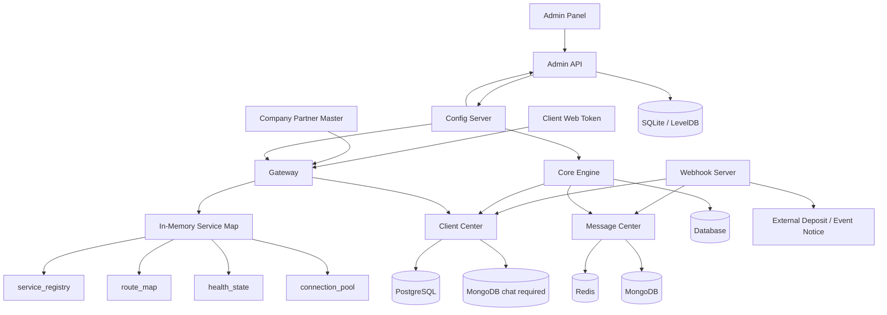

## 2. HTTP GET Flow

**C8:** Client Web uses Token Server token on APIs (after Public login). Company Partner → Client Center uses Master Account Code + Master ID + API Key + Secret.

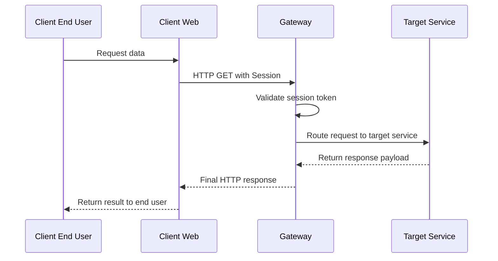

## 3. HTTP POST Flow

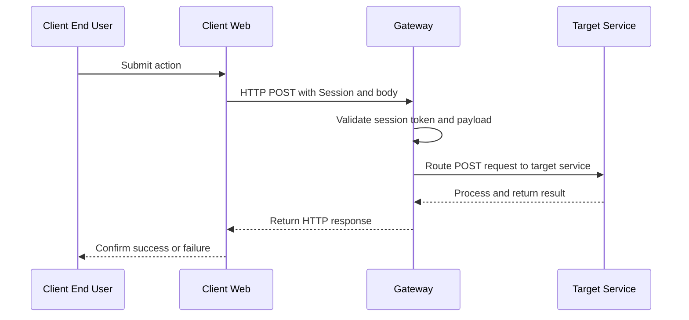

## 4. Client Authentication and Socket Session Flow

Register on Client Web, Partner **OAuth 2.0**, or Platform OAuth for Partner; then Session Token Server issues the Client Web token.

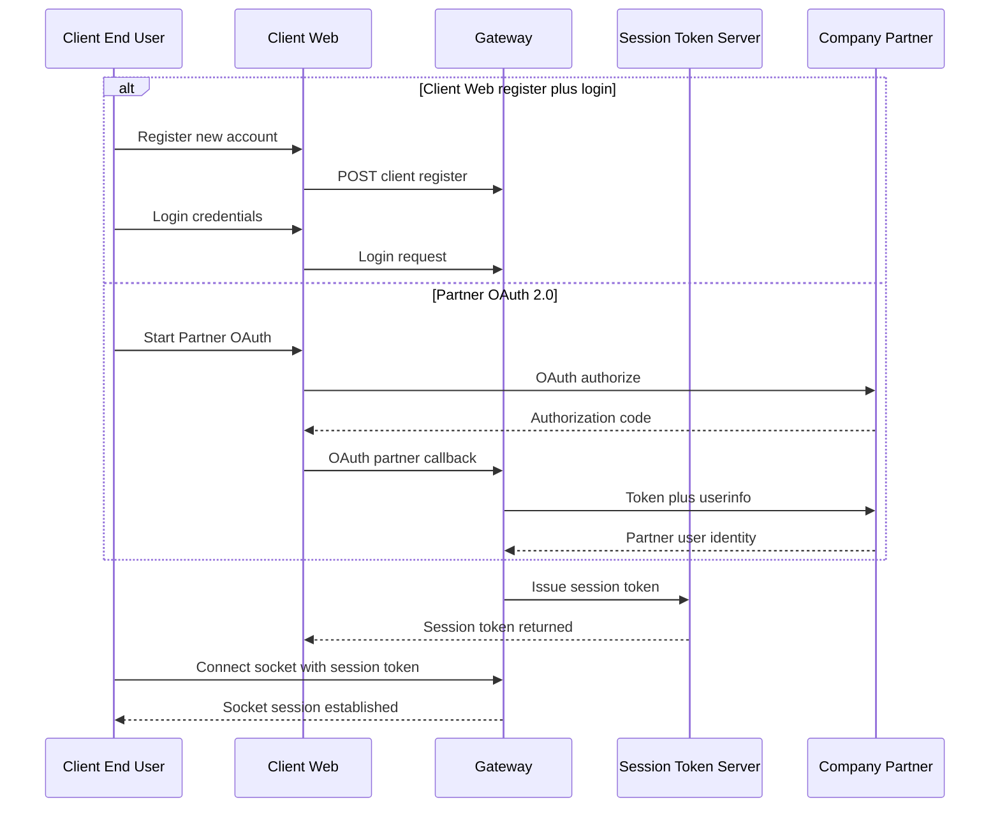

## 5. Order Placement and Matching Flow

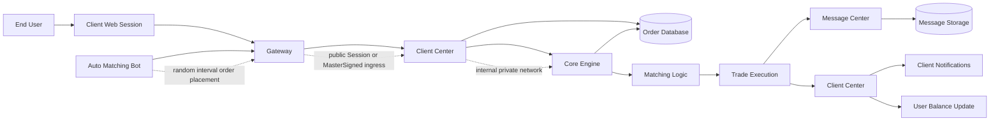

## 6. Market Creation Workflow (Corp Submit + Admin Approve)

**C6 fees:** Year-1 **80K** / renewal **10K** / extra pair **10K**. Fiat = Admin base (**HKD** or **USD**, changeable); or pay **USDT**. See [partner.md](partner.md) §7.

Client Submitted → Under Pending (lock required Game Partner Game Coin pool amount) → Wait Admin User Review → Confirm approval by Admin User → Transfer Client Balance to Pool

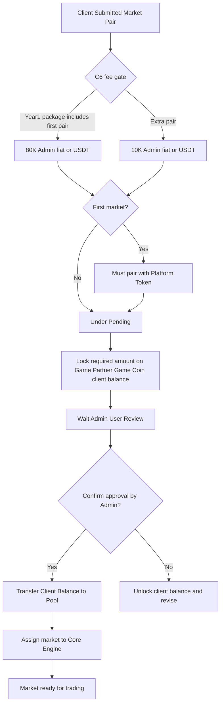

## 7. Heartbeat and Health Check Flow

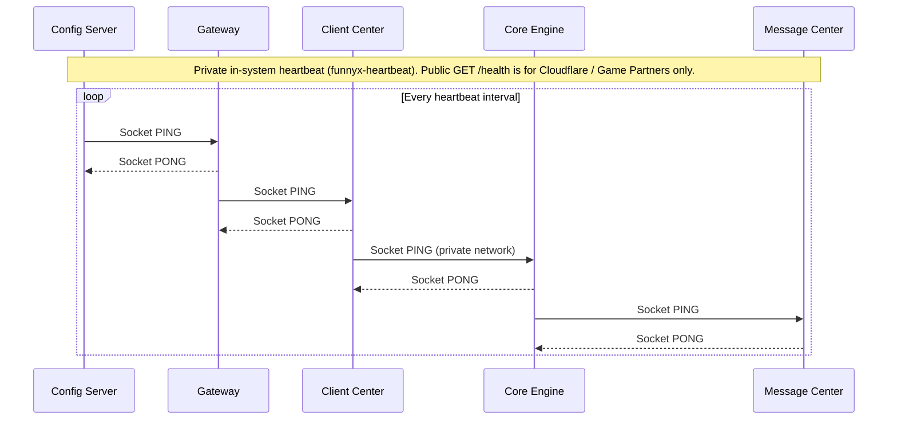

## 8. Config and Heartbeat Flow

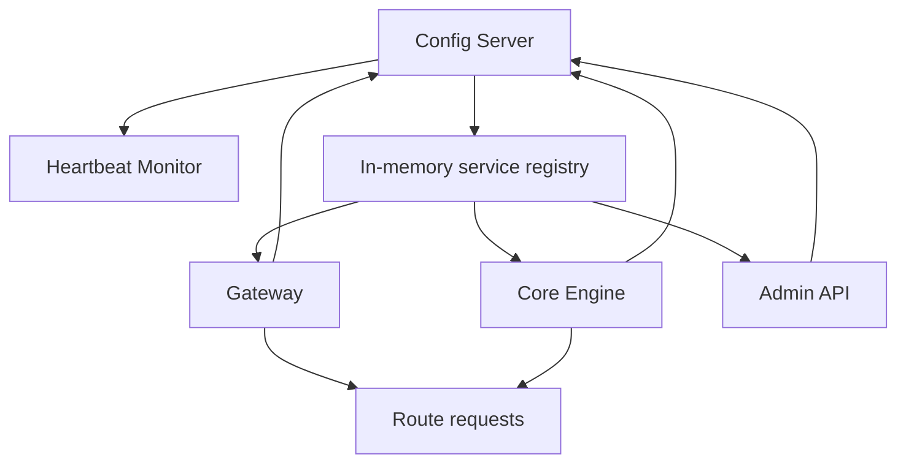

## 9. Message Distribution Flow

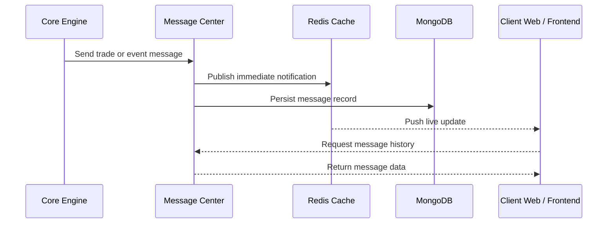

## 10. Client-to-Platform Socket and API Combined Flow

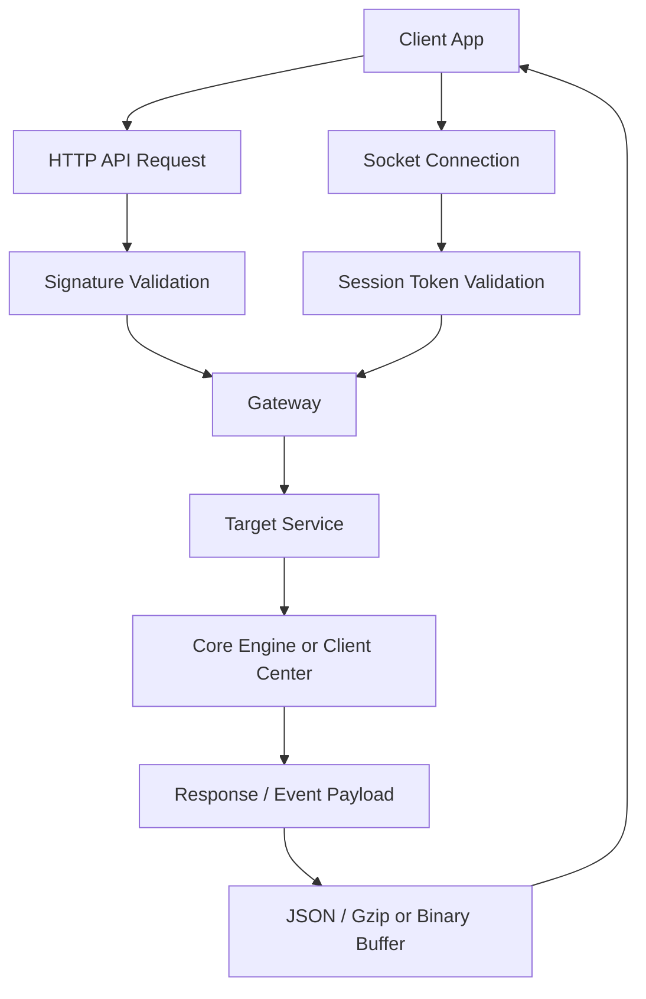

## 11. E-shop Purchase and Webhook Credit Flow

**C2 + C4:** Platform fixed PLT_* **and** Corp-created e-shop products. Partner **fiat** payment (HKD/USD per Admin system base currency). Shop orders do not enter the Core Engine matching path.

**C1 + OAuth:** End User registers on Client Web **or** Partner/Platform **OAuth 2.0** → Session Token Server token → Client Web calls Gateway with **Session**.

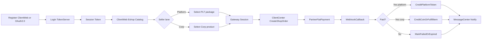

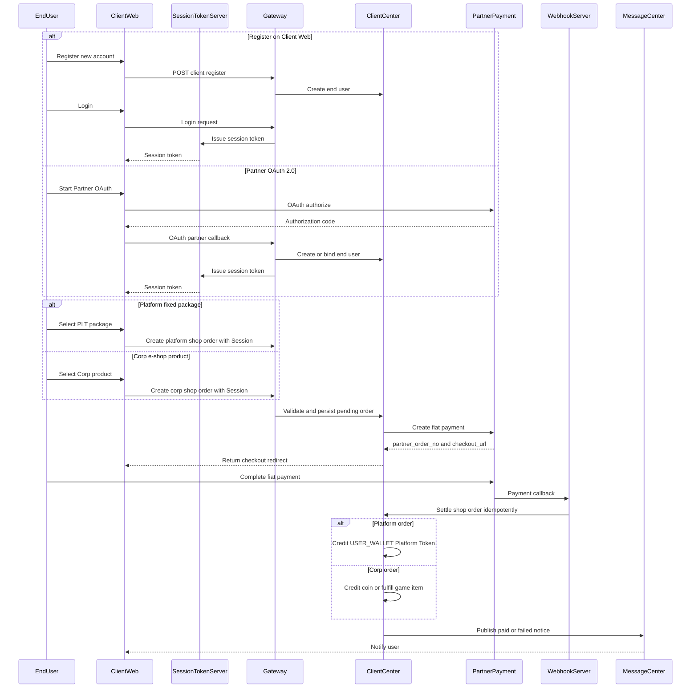

## 12. Company Basic Token Submit → Approve → Buy (0.1% fee)

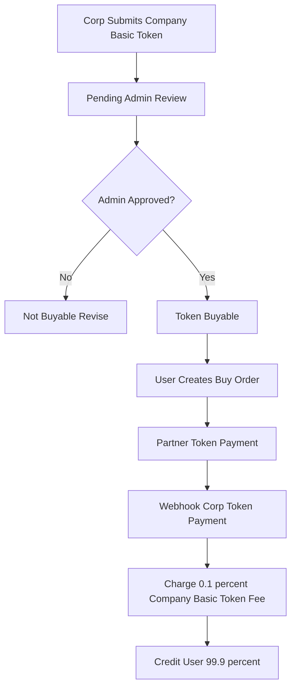
