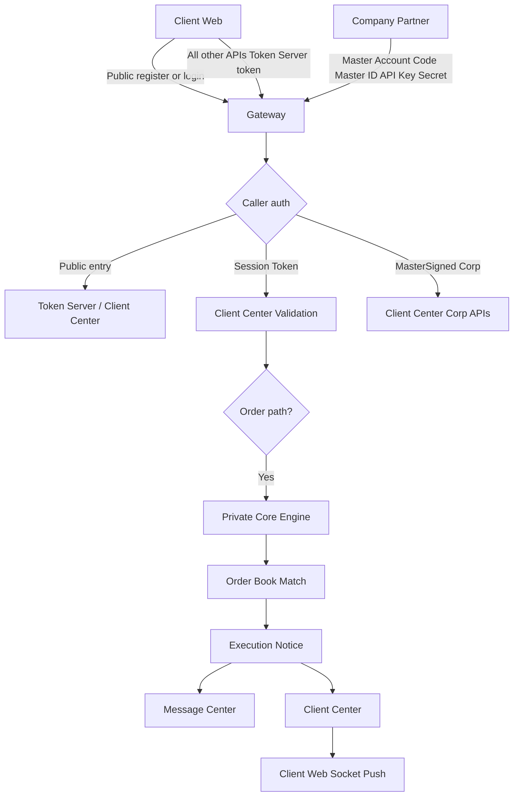
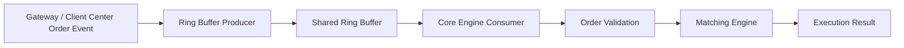
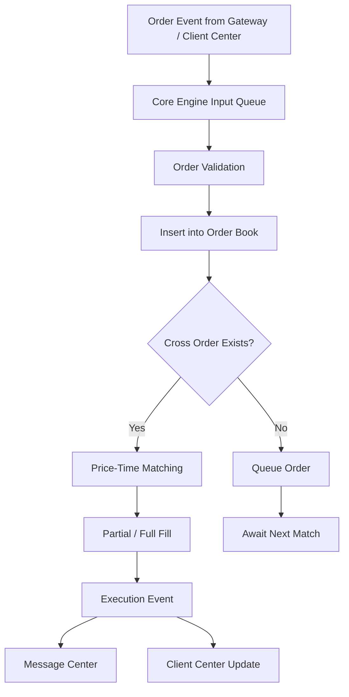
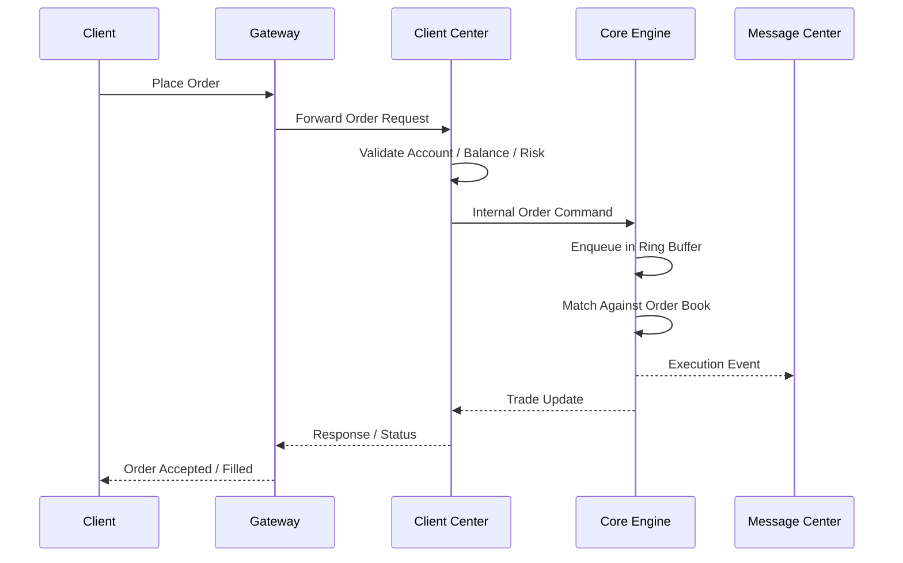

# Gateway Load Balancer and Core Engine Logic

This doc is a detail file for the master architecture in [project.md](project.md) and the API index in [api-master.md](../api-master.md).

**Detail scope:** Gateway load balancing, routing, health, and Core Engine matching execution—see master roles in [project.md §5](project.md#5-server-types-summary).

## 1. Overview

Gateway-first execution for public ingress (Gateway) and private matching (Core Engine via Client Center). Platform context: [project.md](project.md).

The execution model follows this path:

1. Public traffic enters through the Gateway.
2. The Gateway performs load balancing and routing.
3. The Client Center validates account and order state.
4. The private Core Engine receives order commands through the internal network.
5. Matching happens inside the Core Engine using high-speed in-memory order books.
6. Execution notifications are returned to the Message Center and Client Center.

**C8 auth at Gateway / Client Center (summary):**

| Caller | Credential |
| --- | --- |
| **Client Web** | **Token from Session Token Server** on all APIs after login/OAuth (register/login/OAuth Public only to obtain token) |
| **Company Partner** (direct Client Center) | **Master Account Code + Master ID + API Key + Secret** |

Master auth list: [project.md §5.1](project.md#51-auth-master-c8--oauth-20). OAuth + client flows: [client_connect.md](client_connect.md).

The design must support low-latency order handling, high throughput, and stable failover under production load.

The system also includes an auto matching order bot for development and testing. This bot will place random orders and trigger matching behavior at random intervals so the platform can be validated under non-uniform traffic patterns and real-world burst conditions.

Only two order types are supported by the platform:

1. Market Order
2. Price Order

The system command mapping is:

- 01 = Market Order
- 02 = Price Order

This restriction keeps the matching model deterministic and prevents unsupported order variants from entering the execution pipeline.

---

## 2. Gateway Load Balancer Logic

### 2.1 Responsibilities

The Gateway is the public entry point for both HTTP and socket traffic. Its responsibilities include:

- accepting Client Web and Company Partner HTTP/socket traffic
- validating **Token Server tokens** for Client Web APIs (after login)
- validating **Master Account Code + Master ID + API Key + Secret** for Company Partner → Client Center APIs
- checking downstream service health
- load balancing traffic across available Gateway instances
- routing to Client Center (orders reach Core Engine only via Client Center on the private network)
- reporting service health with HTTP GET `/health` and socket PING/PONG

### 2.2 Gateway Selection Policy

A Gateway must choose the most appropriate backend path based on current health and load conditions.

Selection logic should use the following priority:

1. active Gateway instance health check status
2. connection count / current queue depth
3. backend service readiness from Config Server
4. request affinity for a specific user or account when required
5. market or symbol mapping for routing to the correct matching node

Recommended policy:

- use a health-aware round-robin or weighted least-connections strategy
- prefer a stable hash for user session affinity when the same user must stay on the same Gateway or Client Center route
- avoid routing new orders to unhealthy or overloaded nodes

### 2.3 Request Flow



### 2.4 Health and Load Balancing Model

The Gateway must validate upstream readiness using:

- HTTP GET /health from downstream nodes
- socket PING/PONG heartbeat checks
- queue depth and CPU usage checks
- rate-limit thresholds for burst traffic

Because the Gateway is a high-response instance, the runtime decision path must rely on an in-memory service map instead of expensive repeated remote lookups. The mapping table should be refreshed from the Config Server, but each request should read from the local memory snapshot for routing and health selection.

A Gateway node should reject or re-route traffic if any of the following are true:

- downstream server is unhealthy
- socket connection is timed out
- queue backlog exceeds safe threshold
- internal CPU or memory threshold is exceeded

### 2.5 Gateway Routing Rules

For order placement, the Gateway should behave as a distributor rather than performing matching itself. It forwards the request to the Client Center, which validates the request and preserves order state before handoff to the Core Engine.

The critical routing rule is:

- Client Web requests enter through Gateway with Token Server token (except Public register/login)
- Company Partner requests enter with Master Account Code + Master ID + API Key + Secret
- Gateway routes to Client Center for validation and persistence
- Client Center sends order commands to the private Core Engine
- Core Engine performs order matching

This ensures the Core Engine remains private and not directly exposed to external clients.

### 2.6 In-Memory Gateway Map Design

The Gateway should maintain a local, in-memory registry of service topology and runtime metadata. This map is updated from Config Server events and heartbeat checks, but used directly by the request path for fast routing.

| Memory Table | Key | Values Stored | Purpose |
| --- | --- | --- | --- |
| `service_registry` | service_id, service_name | host, port, protocol, role, status, region | Lookup available backend services |
| `service_health` | service_id | last_heartbeat, latency_ms, health_state, fail_count | Decide healthy vs degraded routes |
| `route_map` | path, event_name, symbol | target_service, service_group, timeout, retry_policy | Route requests quickly |
| `connection_pool` | service_id | active_conn, max_conn, queue_depth, pending_count | Balance load and reject overload |
| `market_engine_map` | market_id, symbol | engine_id, matching_node, status | Route market orders to correct engine |
| `failover_map` | primary_service_id | backup_service_id, failover_mode | Recover from backend failure |
| `config_snapshot` | config_version, key | feature flags, rate limits, allowlist, runtime config | Serve fast local config decisions |

This is the recommended runtime data structure for the Gateway because the Gateway must prioritize latency and high-throughput decision making over full remote service lookups.

### 2.7 Gateway Runtime Memory Model (Rust)

The Gateway should keep a local runtime registry in memory so that request routing and health checks are resolved from a hot cache instead of a remote database or config lookup on every call.

The following Rust-style model is recommended:

```rust
use std::collections::HashMap;
use std::sync::Arc;
use tokio::sync::RwLock;

#[derive(Clone, Copy, Debug, PartialEq, Eq)]
pub enum ServiceRole {
    Config,
    Gateway,
    ClientCenter,
    MessageCenter,
    Webhook,
    CoreEngine,
    SessionToken,
    AdminApi,
}

#[derive(Clone, Copy, Debug, PartialEq, Eq)]
pub enum ServiceStatus {
    Healthy,
    Degraded,
    Unhealthy,
    Offline,
}

#[derive(Clone, Debug)]
pub struct ServiceNode {
    pub service_id: String,
    pub service_name: String,
    pub role: ServiceRole,
    pub host: String,
    pub port: u16,
    pub protocol: String,
    pub region: String,
    pub status: ServiceStatus,
    pub last_heartbeat_ms: u64,
    pub uptime_ms: u64,
}

#[derive(Clone, Debug)]
pub struct RouteEntry {
    pub route_key: String,
    pub path: String,
    pub target_service: String,
    pub route_policy: String,
    pub timeout_ms: u64,
    pub retry_count: u8,
    pub enabled: bool,
}

#[derive(Clone, Debug)]
pub struct ConnectionPoolInfo {
    pub service_id: String,
    pub active_conn: usize,
    pub max_conn: usize,
    pub queue_depth: usize,
    pub pending_count: usize,
    pub last_reset_ms: u64,
}

#[derive(Clone, Debug)]
pub struct MarketEngineMapping {
    pub symbol: String,
    pub market_id: String,
    pub engine_id: String,
    pub matching_node: String,
    pub status: ServiceStatus,
}

#[derive(Clone, Debug)]
pub struct FailoverTarget {
    pub primary_service_id: String,
    pub backup_service_id: String,
    pub mode: String,
}

#[derive(Clone, Debug)]
pub struct ConfigSnapshot {
    pub config_version: String,
    pub feature_flags: HashMap<String, bool>,
    pub rate_limits: HashMap<String, u64>,
    pub allowlist: Vec<String>,
    pub thresholds: HashMap<String, u64>,
}

#[derive(Clone, Debug, Default)]
pub struct GatewayMemoryMap {
    pub service_registry: HashMap<String, ServiceNode>,
    pub service_health: HashMap<String, ServiceStatus>,
    pub route_map: HashMap<String, RouteEntry>,
    pub connection_pool: HashMap<String, ConnectionPoolInfo>,
    pub market_engine_map: HashMap<String, MarketEngineMapping>,
    pub failover_map: HashMap<String, FailoverTarget>,
    pub config_snapshot: Option<ConfigSnapshot>,
}

pub type SharedGatewayMemory = Arc<RwLock<GatewayMemoryMap>>;
```

### 2.7.1 Runtime Refresh Strategy

The runtime memory map should be refreshed by the Gateway using a controlled update cycle:

1. Receive a config snapshot or heartbeat update from the Config Server.
2. Validate the payload and update the in-memory structure atomically.
3. Keep the old map until the new values are fully applied.
4. Use the local memory map for request dispatch and health selection.
5. Remove or mark unhealthy nodes when heartbeat timeout occurs.

This is important because the Gateway must remain highly responsive even during burst traffic or backend disruption.

### 2.7.2 Recommended Access Pattern

The typical access pattern is:

```rust
async fn route_request(memory: &SharedGatewayMemory, route_key: &str) -> Option<RouteEntry> {
    let map = memory.read().await;
    map.route_map.get(route_key).cloned()
}

async fn pick_healthy_service(memory: &SharedGatewayMemory, service_group: &str) -> Option<ServiceNode> {
    let map = memory.read().await;
    map.service_registry
        .values()
        .filter(|svc| svc.status == ServiceStatus::Healthy)
        .filter(|svc| svc.role == ServiceRole::CoreEngine || svc.role == ServiceRole::ClientCenter)
        .next()
        .cloned()
}
```

### 2.7.3 Why This Design Matters

This in-memory design ensures that the Gateway can:

- route requests in microseconds instead of performing remote config lookups
- make heartbeat-based failover decisions quickly
- control connection pressure before queue saturation occurs
- direct market orders to the correct matching engine instance
- preserve a consistent runtime view even when the Config Server is briefly unavailable

This is the preferred architecture for a high-response Gateway instance.

---

## 3. Ring Buffer Logic for Order Placement

### 3.1 Purpose

The ring buffer is used to handle high-frequency order placement events efficiently. It reduces locking contention and creates a predictable queue structure for inbound order requests.

The main goals are:

- low-latency ingestion of order requests
- stable memory usage and fixed-size queue control
- high throughput under burst traffic
- separation between request ingestion and matching execution

### 3.2 Ring Buffer Design

A typical ring buffer layout:

- fixed-capacity array of slots
- head index for producer position
- tail index for consumer position
- sequence number for message ordering
- per-slot state: empty, filled, processing, completed

Each slot contains:

- order id
- client id
- symbol
- order type (market or price)
- side (buy/sell)
- price
- quantity
- timestamp
- status (new, accepted, rejected, matched)

### 3.3 Producer and Consumer Flow



### 3.4 Ingestion Process

When a new order is received:

1. Gateway receives the request from the client.
2. Client Center validates user state and account balance.
3. The internal order command is serialized into a compact binary message.
4. The message is placed into the ring buffer by the producer thread.
5. A wake-up signal is sent to the matching worker thread.
6. The Core Engine consumer reads the message from the ring buffer.
7. The order is inserted into the order book for matching.

### 3.5 Ring Buffer Safety Rules

The ring buffer must support multiple producer and consumer patterns under high concurrency without deadlocks.

Recommended rules:

- use a fixed-size buffer and prevent overflow by backpressure
- use atomic index updates for producer and consumer pointers
- use sequence-based ordering for FIFO guarantee by symbol or order id
- set a safe max queue depth to stop overloading the matching engine
- reject or queue incoming order events when the ring buffer is near capacity

### 3.6 Ring Buffer Pseudocode

```rust
struct OrderEventSlot {
    seq: u64,
    order_id: u64,
    client_id: u64,
    symbol: String,
    side: Side,
    price: i64,
    qty: i64,
    ts: i64,
    status: OrderStatus,
}

struct RingBuffer {
    slots: Vec<OrderEventSlot>,
    head: AtomicUsize,
    tail: AtomicUsize,
    capacity: usize,
}

fn enqueue(rb: &RingBuffer, event: OrderEventSlot) -> Result<(), String> {
    let head = rb.head.load(Ordering::Relaxed);
    let next = (head + 1) % rb.capacity;

    if next == rb.tail.load(Ordering::Acquire) {
        return Err("ring buffer full".to_string());
    }

    rb.slots[head] = event;
    rb.head.store(next, Ordering::Release);
    Ok(())
}

fn dequeue(rb: &RingBuffer) -> Option<OrderEventSlot> {
    let tail = rb.tail.load(Ordering::Relaxed);
    if tail == rb.head.load(Ordering::Acquire) {
        return None;
    }

    let event = rb.slots[tail].clone();
    rb.tail.store((tail + 1) % rb.capacity, Ordering::Release);
    Some(event)
}
```

This pattern provides a lightweight queue for order ingestion without requiring a full database write before matching.

---

## 4. Core Engine Logic

### 4.1 Role of the Core Engine

The Core Engine is the matching layer of the platform. It is a private internal service that is not publicly visible.

It is responsible for:

- receiving validated buy and sell order commands
- applying price-time matching rules
- maintaining an in-memory order book
- creating trade execution results
- publishing execution notifications
- updating the user-facing market state

### 4.2 Order Match Pipeline



### 4.3 Order Book Model

The Core Engine should maintain an in-memory order book per trading symbol.

For each symbol, it stores:

- best bid price
- best ask price
- buy queue ordered by price-time priority
- sell queue ordered by price-time priority
- order type classification for each order entry (market or price)
- matched trade records
- open order list and order state map

### 4.4 Matching Rule

The matching engine should follow classic exchange behavior:

1. Compare incoming order with opposite-side best price.
2. If the price crosses, execute match.
3. Use price-time priority to decide which order gets priority.
4. Fill partially if quantity is smaller than the resting order.
5. Keep the remaining quantity on the book as a resting order.
6. Publish trade result events to downstream services.

### 4.5 Price-Time Priority

Price-time priority means:

- higher bid and lower ask are matched first
- among equal prices, earlier orders are executed before later orders

This ensures fairness and deterministic execution behavior.

### 4.6 Match Execution Flow

For each incoming order:

1. read symbol order book
2. check if opposite-side price crosses
3. if match is possible, consume the best resting order
4. calculate trade quantity as the minimum of incoming and resting order quantity
5. update both order statuses
6. create execution record
7. send execution event through socket to Message Center and Client Center
8. if remaining quantity exists, reinsert or keep the resting order

### 4.7 Matching Algorithm Example

```rust
fn match_order(book: &mut OrderBook, incoming: &Order) {
    while incoming.remaining_qty > 0 {
        let best = book.best_opposite(incoming.side);

        match best {
            Some(resting) if incoming.can_match(resting) => {
                let trade_qty = incoming.remaining_qty.min(resting.remaining_qty);

                incoming.remaining_qty -= trade_qty;
                resting.remaining_qty -= trade_qty;

                book.record_trade(incoming.order_id, resting.order_id, trade_qty);

                if resting.remaining_qty == 0 {
                    book.remove(resting.order_id);
                }

                if incoming.remaining_qty == 0 {
                    break;
                }
            }
            _ => {
                book.insert_order(incoming.clone());
                break;
            }
        }
    }
}
```

### 4.8 Execution Event Publishing

After each trade or order update:

- send execution message to Message Center
- send account position update to Client Center
- broadcast market data event through socket-market-data
- update database state asynchronously based on business requirements

This keeps the Core Engine focused on matching and execution speed while the surrounding services handle persistence and user notification.

---

## 5. Combined External and Internal Flow



---

## 6. Design Principles

1. Gateway is public and load-balancing oriented.
2. Client Center is validation and orchestration oriented.
3. Core Engine is private and matching oriented.
4. Ring buffers decouple ingestion from matching.
5. Matching must prioritize price-time fairness.
6. Execution notifications must be asynchronous and non-blocking for the matching loop.
7. All service health must be checked using both socket heartbeat and HTTP GET /health.

---

## 7. Implementation Guidance

For production deployment, the Core Engine should consider:

- per-symbol independent order books
- memory pooling for order slots
- lock-free or reduced-lock queue handling
- fixed-size ring buffers to prevent runaway memory growth
- worker threads dedicated to matching and event publishing
- asynchronous persistence of trade history and account changes

The Gateway should focus on:

- stable request admission
- health-aware routing
- connection management
- protection against overload and burst traffic
- forwarding to the correct internal service with minimal delay

This architecture preserves low latency while keeping the public attack surface small and the matching core isolated and efficient.
