# Partner integration UML

Master contracts: [partner.md](partner.md). Auth identity sources: [client_connect.md](client_connect.md). Marketplace gates: [marketplace.md](marketplace.md). Local simulator: [`dev_simulator/company-a-server`](../dev_simulator/company-a-server/). Client Center bind APIs: [`backend/client_center/README.md`](../backend/client_center/README.md).

**Detail scope:** UML / sequence views of Company Partner setup, OAuth, **game-account mapping** (Path A / Path B), Transfer, Item List, optional balance/deposit/withdraw — not fee tables or e-shop fiat JSON (those live in [partner.md](partner.md)).

---

## 1. Component overview

Partner backend endpoints the Corporate User registers with FunnyX (`partner.md` §1.2). Simulator implements these on `company-a-server` (default `:18102`).

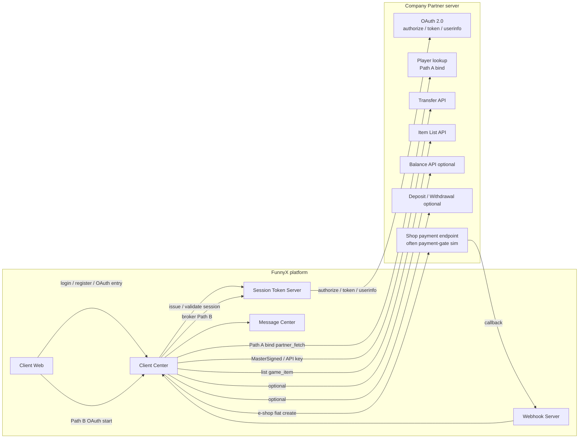

---

## 2. Corporate partner setup (endpoint registration)

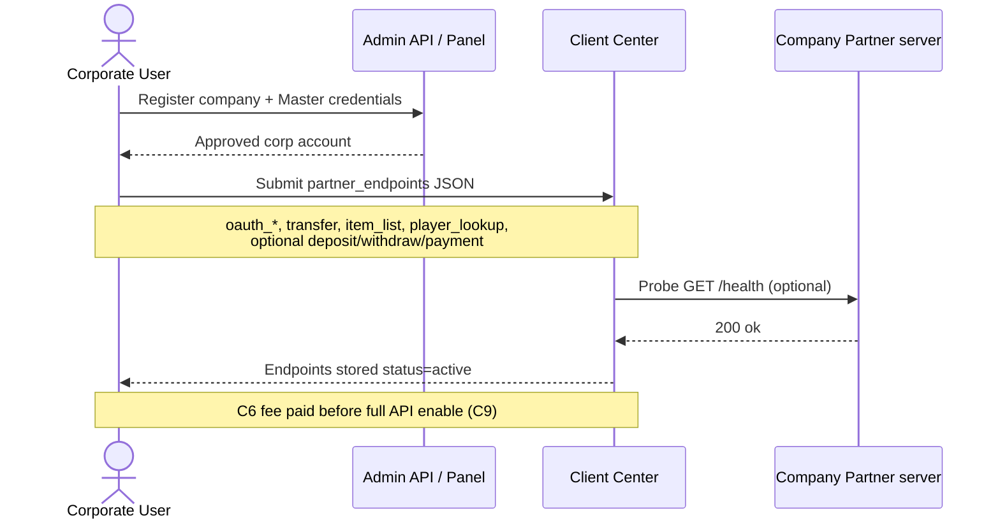

**Setup payload shape** (see also `GET /v1/partner/setup` on the simulator):

```json
{
  "partner_id": "partner_2001",
  "company_name": "Company A Game Partner",
  "server_name": "company-a-server",
  "endpoints": [
    { "type": "oauth_authorize", "endpoint": "http://127.0.0.1:18102/oauth/authorize" },
    { "type": "oauth_token", "endpoint": "http://127.0.0.1:18102/oauth/token" },
    { "type": "oauth_userinfo", "endpoint": "http://127.0.0.1:18102/oauth/userinfo" },
    { "type": "player_lookup", "endpoint": "http://127.0.0.1:18102/api/players/lookup" },
    { "type": "transfer", "endpoint": "http://127.0.0.1:18102/api/transfer" },
    { "type": "item_list", "endpoint": "http://127.0.0.1:18102/api/items" },
    { "type": "balance", "endpoint": "http://127.0.0.1:18102/api/balance" },
    { "type": "deposit", "endpoint": "http://127.0.0.1:18102/api/deposit" },
    { "type": "withdrawal", "endpoint": "http://127.0.0.1:18102/api/withdrawal" },
    { "type": "callback", "endpoint": "http://127.0.0.1:18102/api/callback" }
  ],
  "auth_type": "signature",
  "api_key": "demo-api-key",
  "status": "active"
}
```

---

## 3. Game-account mapping (both login paths)

After identity exists, the platform writes a mapping keyed by **`end_user_id` + `game_id`** → `game_account_id` (in-memory on Client Center today; target table `fx_game.game_accounts`). **Prerequisite:** the game row must already exist on the platform catalog (`GET /v1/client/games`).

Narrative for Path A/B/C registration sources: [client_connect.md](client_connect.md) §2 — this section is the UML for **mapping creation only**.

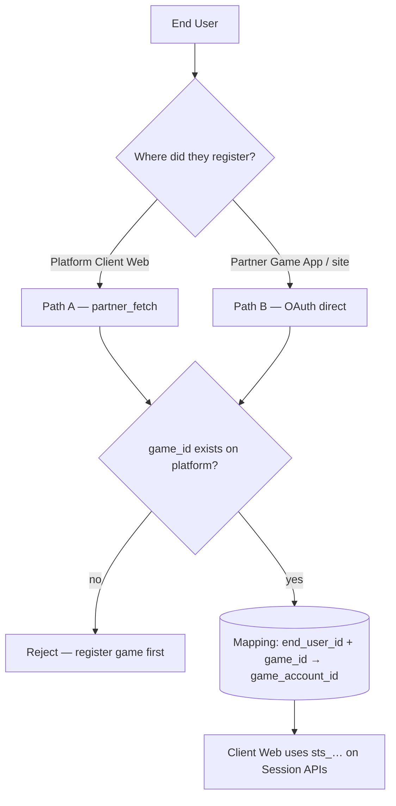

| | Path A — Platform then Partner fetch | Path B — Game App / Partner OAuth |
| --- | --- | --- |
| Identity first | `POST /v1/client/register` or `login` → STS session | Partner OAuth via CC → STS broker |
| Game check | Platform `game_id` / `game_code` | Same (resolve via `partner_game_id` or `partner_id`) |
| Partner call | `GET /api/players/lookup` | Already covered by OAuth userinfo |
| Mapping write | `POST /v1/client/game-accounts/bind` `mode=partner_fetch` | Auto on `/partner/complete`, or `mode=direct` |

### 3.1 Path A — Platform register/login, then Partner lookup bind

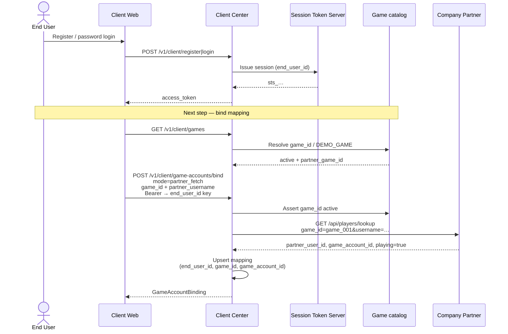

### 3.2 Path B — Partner OAuth (Game App), direct mapping

Client Web does **not** exchange the Partner token itself; Session Token Server brokers OAuth, then Client Center writes the mapping.

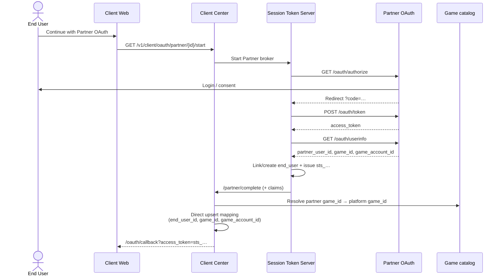

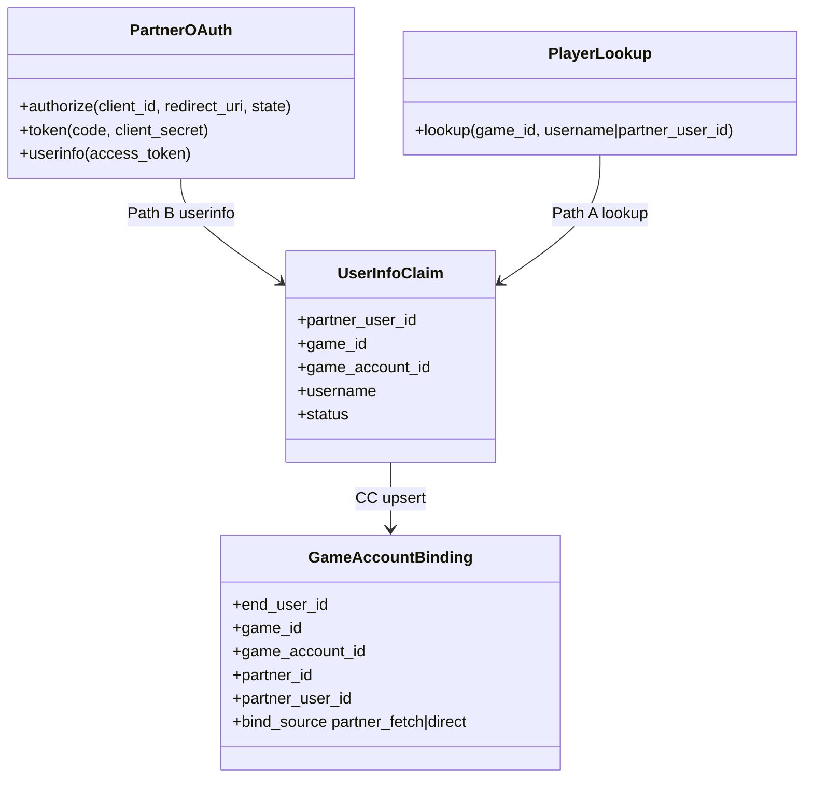

---

## 4. Marketplace: Item List + Transfer (C7)

Place-deal gates require Transfer open; `game_item` also requires Item List → opaque `item_ref_id`. Mapping from §3 must already exist for the user’s `game_account_id`.

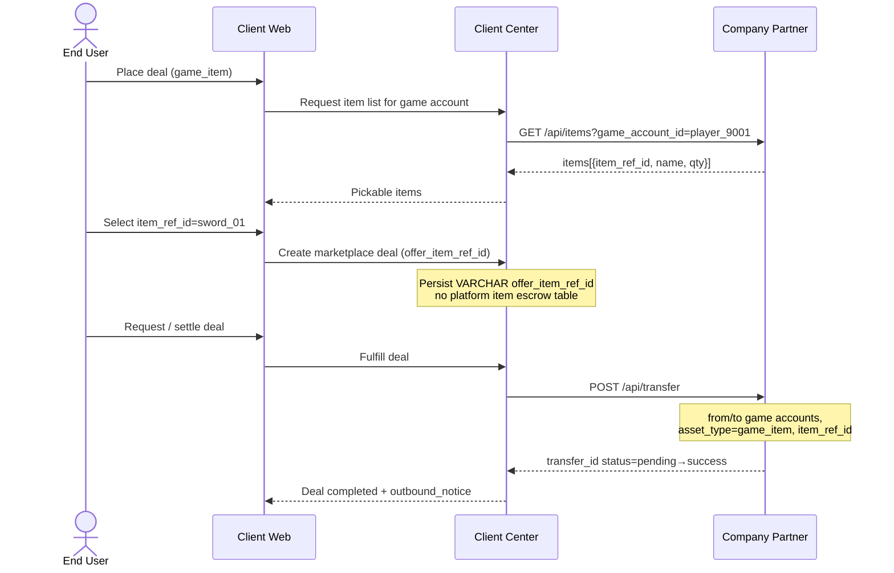

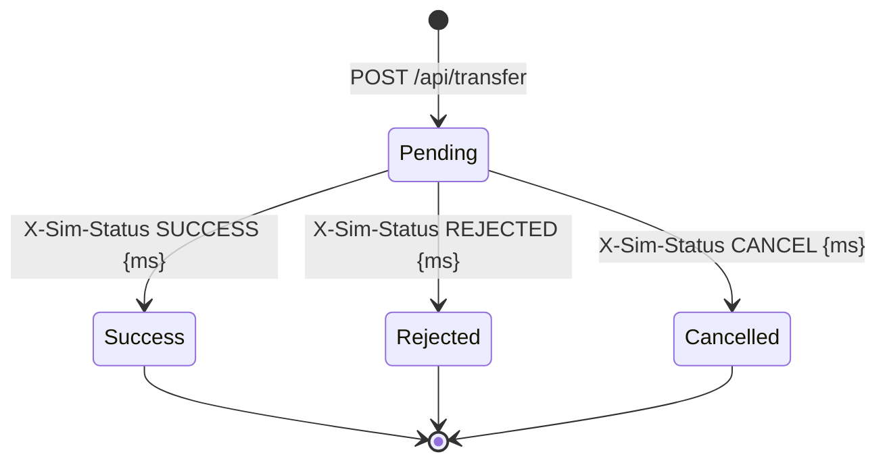

---

## 5. Optional deposit / withdrawal (partner wallet path)

Used only when the partner provides their own money APIs instead of platform wallet APIs. Fee / fiat tables: [partner.md](partner.md).

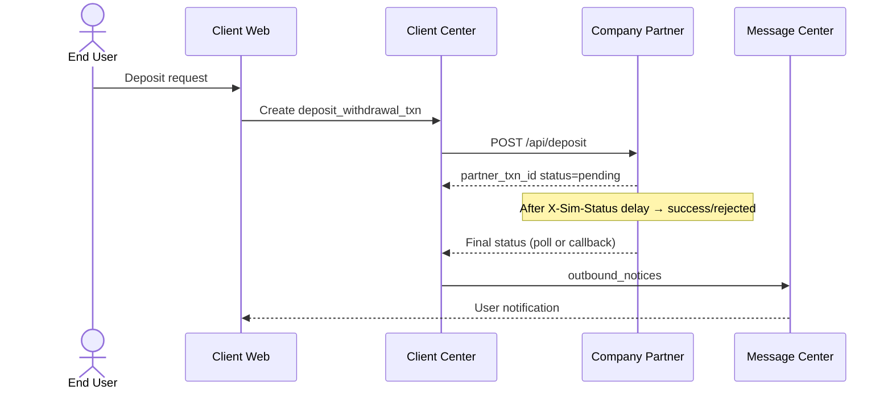

---

## 6. Required vs optional API matrix

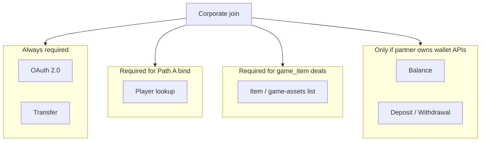

| # | API | Simulator path | Required? |
| --- | --- | --- | --- |
| 1 | OAuth 2.0 | `/oauth/authorize`, `/oauth/token`, `/oauth/userinfo` | Yes |
| 2 | Balance | `GET /api/balance` | Optional |
| 3 | Deposit / Withdrawal | `POST /api/deposit`, `POST /api/withdrawal` | Optional |
| 4 | Transfer | `POST /api/transfer` | Yes |
| 5 | Item List | `GET /api/items` | Yes for Marketplace `game_item` |
| 6 | Player lookup | `GET /api/players/lookup` | Yes for Path A `partner_fetch` bind |

---

## 7. Local simulator topology

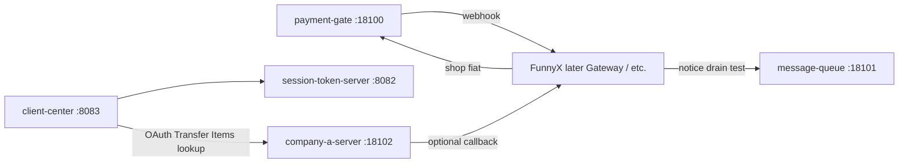

Run guide: [`dev_simulator/README.md`](../dev_simulator/README.md), [`dev_simulator/company-a-server/README.md`](../dev_simulator/company-a-server/README.md).
