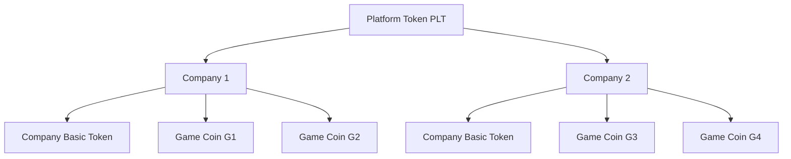
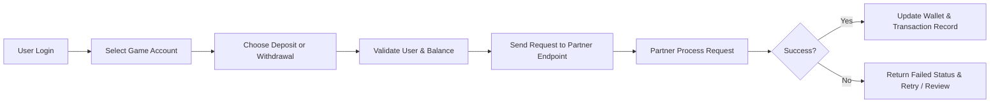
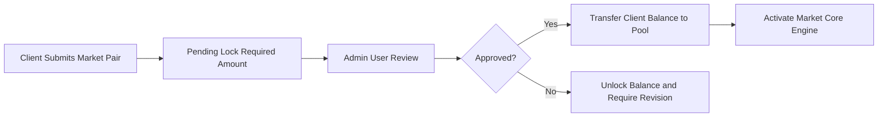

<!-- AI-CONSTRAINT: READ-ONLY FILE. DO NOT UPDATE OR MODIFY. -->

## Project Scope and Motivation

This project is a personal engineering prototype built to deepen my experience in system design, high-performance architecture, and digital asset platform development. It uses a flexible, exploratory design approach and focuses on a large-scale, high-throughput platform for a game-related financial ecosystem.

The idea started in December 2019. While reading online novels, I noticed that game items and in-game currency could sometimes be exchanged for real-world money. That concept was originally planned as my Final Year Project. Design and development took longer than expected, so I only built a prototype with sample code and chose a different topic for graduation. I still hope to finish this project and treat it as one of the milestones in my career.

### Goal

This file is the master truth source for naming, product flow, and rules. The project-level term definitions are:

- **Platform Token** = the project token, named `PLT`
- **Company Basic Token** = each company’s company token
- **Game Coin** = each game application’s token/coin used inside that specific game

The core goal is a three-level token ecosystem:

**Platform Token (`PLT`) → Company Basic Token → Game Coin**

1. **Platform Token (`PLT`)** is the root currency of the whole platform.
2. **Companies** (Corporate Users) sit under Platform Token. Each company runs its own economy, including a Company Basic Token after Admin approval.
3. **Games** under each company (G1, G2, G3, …) use Game Coin specific to that game application, while all companies share one platform root for exchange and settlement.



In practice this means:

- Players obtain Platform Token (`PLT`) through the fixed platform e-shop packages (token settlement via partner), then use it across companies and markets.
- Each company onboards its own games; value can be repositioned across that company’s games through the company token and game-scoped coins.
- Company Basic Token (corp-submitted, admin-approved) and market pairs hang off this hierarchy; the **first market must pair with Platform Token (`PLT`)**.
- Exchange, deposits, withdrawals, and transfers all serve this chain: Platform Token (`PLT`) → Company Basic Token → Game Coin.
- Normal users may place deals on the Platform Marketplace. They may sell value into Platform Token (`PLT`), into a Company Basic Token, or into a Game Coin — but only with the correct parent-company relationship.
- The Marketplace lets normal users place orders for: Game Coin, Company Basic Token, and Game Items.

#### Required Company Partner APIs

If Partner prefer to provide their API instead to use our API, then 1, 2 , 3 and 4 both needed, otherwise only 1 and 4 are needed.

1. OAuth 2.0 Login for User Verify on Platform
2. User current balance
3. User deposit and withdrawal APIs
4. Transfer API for Game Items and coins (Company Coin and Game Coin)
5. API for listout user account game assets 

** Platform will be provide OAuth 2.0 Login for user, who already registered on Partner, also Step 1 allow user to registered on platform then login on Partner.

#### Suggestions for Company Partners

1. Do not keep authoritative balances on the partner game server; delegate balance to the platform API.
2. Use platform-provided wallet APIs for all wallet operations.
3. Suggest user to open normal user account on platform.

*** Platform Demo Scenario ***

*** Demo to set Platform set HKD as base currency ***

The platform helps game companies build a realistic cross-game financial and trading environment on shared infrastructure, with reusable in-game currency value and interoperable market mechanisms. This toy project is free for study and learning. Company operations, e-shop pricing, and platform-fee settlement follow the Admin configuration and company-owner settings defined in the platform rules.

This project focuses on the exchange and circulation of Game Partner Game Coin across multiple game ecosystems. The base e-shop and platform-fee setup is controlled by the Admin configuration (`HKD` or `USD`), while company-owned token and game-token settlement follows the owning company’s configuration. The overall flow is:

1. A game company registers as a Corporate User and submits its game information for onboarding.
2. After approval, the game enters a ready state and receives a Game Account ID.
3. The game owner submits the initial Game Partner Game Coin supply size, and the platform creates the corresponding game balance account.
4. If the game owner wants to create a trading pair, the company submits a market request. While pending, the platform locks the required pool amount on the client balance; funding may come from company-owned Game Partner Game Coin or the configured company settlement route.
5. Each time a company raises the total Game Partner Game Coin supply or creates a new market, the platform fee follows the Admin-configured platform rule and base setting before the request remains eligible for admin review.
6. After admin approval, the platform transfers the locked client balance into the market pool wallet, creates the market core engine, and enables trading, deposits, withdrawals, transfers between games, and in-game economic activity.

Create Game Market flow:
1. **Client Submitted** — Corporate user submits a new Game Partner Game Coin pair / market request (first market must pair with Platform Token) and pays the configured platform fee under the Admin policy when required.
2. **Under Pending** — Platform locks the required pool amount on the client balance. Funding may be A) existing Game Partner Game Coin already submitted by the company, or B) the configured company settlement route. Balance is locked, not yet moved into the market pool.
3. **Wait Admin User Review** — Request stays in the pending market queue for Admin Panel review (pair, fee, funding source, required lock amount).
4. **Confirm approval by Admin User** — Admin approves or rejects. On reject, unlock the reserved client balance and return for correction.
5. **Transfer Client Balance to Pool** — On approval, transfer the locked client balance into the market pool wallet, create/activate the market core engine, and open trading, deposits, withdrawals, transfers, and gameplay economy flows.

Important: The first market initialization must be paired with the Platform Token.

```mermaid
flowchart LR
    A[Game Company Registers] --> B[Corporate User Approval]
    B --> C[Game Ready State]
    C --> D[Game Account ID Assigned]
    D --> E[Initial Game Partner Game Coin Supply Submitted]
    E --> F[Game Balance Account Created]
    F --> G[Client Submits Market Pair]
    G --> H[Pending Lock Required Amount]
    H --> I[Admin User Review]
    I --> J{Approved?}
    J -->|Yes| K[Transfer Client Balance to Pool]
    K --> L[Market Core Engine Created]
    L --> M[Trading Deposit Withdraw Transfer]
    J -->|No| N[Unlock Balance and Revise]
```



### Deposit and Withdrawal Flow

1. A user signs in and selects a game account.
2. The user chooses either deposit or withdrawal.
3. The platform validates the user identity, balance, and game account mapping.
4. The request is forwarded to the approved corporate partner endpoint.
5. The partner server processes the request and returns success or failure.
6. The platform updates the wallet status and records the final transaction result.



### Admin Approval Flow

1. **Client Submitted** — Corporate User submits a new Game Partner Game Coin pair or market request (with pool depth / initial price / required amounts).
2. **Under Pending** — Platform records the request in the pending market queue and locks the required pool amount on the client balance.
3. **Wait Admin User Review** — Admin Panel reviews pair, fee payment, funding source, and locked amount.
4. **Confirm approval by Admin User** — Admin approves or rejects.
5. **Transfer Client Balance to Pool** — On approval, transfer locked client balance into the market pool wallet and activate the market core engine.
6. On reject, unlock the reserved client balance and return the request for correction or resubmission.



### Example Use Case

After the company owner creates a pool, players are directed to the frontend, where they can buy Platform Token or exchange it for a target game’s coin. When players move to another game from the same company, they can carry value across titles instead of spending repeatedly in each game. That reduces player cost and gives the company a central API for the most expensive and complex parts of the economy.

### E-shop (Platform Token Packages)

The Client Web e-shop sells **fixed Platform Token packages** under the Admin-configured base currency (`HKD` or `USD`). Platform Token purchases follow the Admin base setting. Company-owned token and game-token settlement follow the owning company’s settings. The partner payment flow settles under the configured e-shop policy and credits the user after a successful webhook settlement.

Fixed packages:

| Package code | Platform Token credited | Platform Price (HKD) |
| --- | ---: | ---: |
| `PLT_1000` | 1,000 | 8.8 |
| `PLT_1500` | 1,500 | 13 |
| `PLT_3000` | 3,000 | 27 |
| `PLT_10000` | 10,000 | 75 |

1. Platform seeds/activates the fixed packages above for the Platform Token.
2. The user selects a package and the platform creates a pending shop order.
3. The partner collects **token** payment and returns a payment reference.
4. The Webhook Server receives the payment callback (`POST /v1/webhook/shop/payment` on port **8084**).
5. On success, the platform credits Platform Token to the user wallet and records a `shop_topup` transaction.
6. Duplicate callbacks are ignored through idempotent settlement on `event_id` / `partner_order_no`.

Shop orders are separate from exchange market orders and do not go through the Core Engine. Full detail: [doc/e-shop.md](doc/e-shop.md).

### Company Basic Token (Corp submit → Admin approve → User buy)

Corporate Users may submit their **Company Basic Token** (the company’s primary company token). After Admin approval, end users may buy that token on the platform under the company’s configured settlement rules. The platform fee remains governed by the Admin-configured base policy, while the owning company controls its own token settlement settings.

Flow:
1. **Corp Submitted** — Corporate User submits Company Basic Token metadata (code, name, linked game, and buy offer settings).
2. **Admin Review** — Admin Panel approves or rejects the token.
3. **Buyable** — On approval, the token becomes available for end users to buy (Client Web).
4. **Purchase fee** — On each buy, **0.1%** of the purchased **Company Basic Token** amount is charged as a platform fee under the Admin-defined policy. The user receives **99.9%** of the purchased amount.

Example: user buys 1,000 Company Basic Token → fee 1 token to platform → user credited 999 tokens.

Notes:
- Company Basic Token is not the Platform Token; Platform Token packages remain the fixed e-shop catalog above.
- First market for a game must still pair with the Platform Token.
- Rejected submissions are not buyable; corp may revise and resubmit.
- Settlement follows the company’s configured token policy; the Admin base policy governs platform fees and platform-token e-shop pricing.

---

## Canonical master reference blocks

### Master architecture summary

This repository keeps one master product summary in the root README and uses the topic-specific documents as detail references. In practice:
- [doc/project.md](doc/project.md) defines the architecture and business rules
- [api-master.md](api-master.md) defines the HTTP API surface
- [development.md](development.md) defines execution order and status
- [technology.md](technology.md) defines the stack and runtime model
- [doc/e-shop.md](doc/e-shop.md), [doc/partner.md](doc/partner.md), and [doc/client_connect.md](doc/client_connect.md) define the payment, partner, and auth flows

### Shared payment callback example

```json
{
  "event_id": "pay_evt_8899",
  "partner_order_no": "PAY-7788",
  "shop_order_id": 5001,
  "seller_type": "platform",
  "status": "paid",
  "fiat_currency": "HKD",
  "fiat_paid": 88.00,
  "credit_game_coin": "PLT",
  "credit_amount": 1000,
  "paid_at": "2026-09-28T01:05:00Z",
  "signature": "***"
}
```

This example is the canonical callback shape for the platform e-shop payment flow. The webhook server verifies it idempotently before crediting the wallet or fulfilling the order.

---

## Disclaimer

This project is created for educational purposes, personal learning, and experimentation only. It is not intended for commercial deployment, production trading, regulated financial service use, or real-money operations without proper legal review and compliance assessment.

This repository is provided as a free-to-use demo and learning project. You may fork, study, and modify it for educational or non-commercial purposes. If you reuse or fork this project, you must change the project name and clearly differentiate it from the original project.

## License

This project is released as free to use for education and personal experimentation.

Terms:
- Free for learning, study, and non-commercial use.
- You may fork and change the code for your own project.
- You must rename the project when forking or adapting it.
- Commercial use is not allowed unless you do not generate any profit from this project.
- The original author retains the right to the project identity and project naming.

---

@Auth: Kwan PANG @ Game, Exchagne & Survival
Hong Konger and 15yr+ developer.
